# TinyBlog: Develop your First Web App with Pharo

Olivier Auverlot, Stéphane Ducasse and Luc Fabresse

April 1, 2020

Copyright 2017 by Olivier Auverlot, Stéphane Ducasse and Luc Fabresse.

The contents of this book are protected under the Creative Commons Attribution-ShareAlike 3.0 Unported license.

You are **free**:

- to **Share**: to copy, distribute and transmit the work,
- to **Remix**: to adapt the work,

Under the following conditions:

- Attribution. You must attribute the work in the manner specified by the author or licensor (but not in any way that suggests that they endorse you or your use of the work).
- Share Alike. If you alter, transform, or build upon this work, you may distribute the resulting work only under the same, similar or a compatible license.

For any reuse or distribution, you must make clear to others the license terms of this work. The best way to do this is with a link to this web page: <http://creativecommons.org/licenses/by-sa/3.0/>

Any of the above conditions can be waived if you get permission from the copyright holder. Nothing in this license impairs or restricts the author's moral rights.

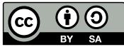

Your fair dealing and other rights are in no way affected by the above. This is a humanreadable summary of the Legal Code (the full license): <http://creativecommons.org/licenses/by-sa/3.0/legalcode>

Layout and typography based on the sbabook LATEX class by Damien Pollet.

# Contents

|     | Illustrations                                        | iv |
|-----|------------------------------------------------------|----|
| 1   | About this book                                      | 1  |
| 1.1 | Structure .<br>.                                     | 1  |
| 1.2 | .<br>Pharo Installation                              | 2  |
| 1.3 | .<br>Naming Rules                                    | 2  |
| 1.4 | .<br>Resources                                       | 3  |
| 2   | TinyBlog Application: Core model                     | 5  |
| 2.1 | .<br>TBPost Class                                    | 5  |
| 2.2 | Post Visibility .<br>.                               | 6  |
| 2.3 | .<br>Initialization                                  | 7  |
| 2.4 | .<br>Posts Creation Methods                          | 7  |
| 2.5 | .<br>Creating a Post                                 | 8  |
| 2.6 | .<br>Adding Some Unit Tests                          | 8  |
| 2.7 | Post Queries .<br>.                                  | 9  |
| 2.8 | Conclusion .<br>.                                    | 10 |
| 3   | TinyBlog: Extending and Testing the Model            | 11 |
| 3.1 | .<br>TBBlog class                                    | 11 |
| 3.2 | .<br>Only One Blog Object                            | 12 |
| 3.3 | .<br>Testing the Model                               | 12 |
| 3.4 | A First Test .<br>.                                  | 13 |
| 3.5 | .<br>Increasing Test Coverage                        | 14 |
| 3.6 | .<br>Other Functionalities                           | 14 |
| 3.7 | .<br>Testing data                                    | 16 |
| 3.8 | .<br>Possible Extensions                             | 17 |
| 3.9 | Conclusion .<br>.                                    | 17 |
| 4   | Data Persitency using Voyage and Mongo               | 19 |
| 4.1 | Configure Voyage to Save TBBlog Objects .<br>.       | 19 |
| 4.2 | .<br>Saving a Blog                                   | 21 |
| 4.3 | Revising Unit Tests .<br>.                           | 21 |
| 4.4 | .<br>Querying the Database                           | 22 |
| 4.5 | If we would Save Posts [Discussion] .<br>.           | 22 |
| 4.6 | .<br>Configure an External Mongo Database [Optional] | 23 |
| 4.7 | Conclusion .<br>.                                    | 25 |

| 5    | First Steps with Seaside                          | 27 |
|------|---------------------------------------------------|----|
| 5.1  | .<br>Starting Seaside                             | 28 |
| 5.2  | .<br>Bootstrap for Seaside                        | 28 |
| 5.3  | .<br>Define our Application Entry Point           | 29 |
| 5.4  | First Simple Rendering .<br>.                     | 31 |
| 5.5  | .<br>Architecture                                 | 32 |
| 5.6  | Conclusion .<br>.                                 | 33 |
| 6    | Web Components for TinyBlog                       | 35 |
| 6.1  | .<br>Visual Components                            | 35 |
| 6.2  | .<br>Using the TBScreenComponent component        | 37 |
| 6.3  | .<br>Pattern of Component Definition              | 37 |
| 6.4  | .<br>Populating the Blog                          | 38 |
| 6.5  | .<br>Definition of TBHeaderComponent              | 38 |
| 6.6  | .<br>Usage of TBHeaderComponent                   | 38 |
| 6.7  | .<br>Composite-Component Relationship             | 39 |
| 6.8  | .<br>Render an header                             | 39 |
| 6.9  | .<br>List of Posts                                | 41 |
| 6.10 | The PostComponent .<br>.                          | 42 |
| 6.11 | .<br>Display Posts                                | 43 |
| 6.12 | .<br>Debugging Errors                             | 44 |
| 6.13 | .<br>Displaying the List of Posts with Bootstrap  | 44 |
| 6.14 | .<br>Instantiating Components in renderContentOn: | 45 |
| 6.15 | Conclusion .<br>.                                 | 46 |
| 7    | Managing Categories                               | 47 |
| 7.1  | .<br>Displaying Posts by Category                 | 47 |
| 7.2  | .<br>Category Rendering                           | 49 |
| 7.3  | .<br>Updating Post List                           | 50 |
| 7.4  | Look and Layout .<br>.                            | 50 |
| 7.5  | .<br>Modular Code with Small Methods              | 52 |
| 7.6  | Conclusion .<br>.                                 | 54 |
| 8    | Authentication and Session                        | 55 |
| 8.1  | A Simple Admin Component (v1) .<br>.              | 56 |
| 8.2  | .<br>Adding 'admin' Button                        | 56 |
| 8.3  | .<br>Header Revision                              | 58 |
| 8.4  | Admin Button Activation .<br>.                    | 58 |
| 8.5  | 'disconnect' Button Addition .<br>.               | 59 |
| 8.6  | Modal Window for Authentication .<br>.            | 60 |
| 8.7  | .<br>Authentication Component Rendering           | 62 |
| 8.8  | .<br>Authentication Component Integration         | 63 |
| 8.9  | .<br>Naively Managing Logins                      | 64 |
| 8.10 | Managing Errors .<br>.                            | 64 |
| 8.11 | Modeling the Admin .<br>.                         | 65 |
| 8.12 | .<br>Blog admin                                   | 67 |
|      |                                                   |    |

| 8.13 | .<br>Setting a New Admin                                               | 67 |
|------|------------------------------------------------------------------------|----|
| 8.14 | .<br>Integrating the Admin Information                                 | 68 |
| 8.15 | .<br>Storing the Admin in the Current Session                          | 68 |
| 8.16 | .<br>Definition and use of specific session                            | 68 |
| 8.17 | .<br>Storing the Current Admin                                         | 70 |
| 8.18 | .<br>Simplified navigation                                             | 70 |
| 8.19 | Managing Deconnection .<br>.                                           | 70 |
| 8.20 | .<br>Simplified Navigation to the Public Part                          | 71 |
| 8.21 | Conclusion .<br>.                                                      | 71 |
| 9    | Administration Web Interface and Automatic Form Generation             | 73 |
| 9.1  | Describing Domain Data .<br>.                                          | 73 |
| 9.2  | .<br>Post Description                                                  | 75 |
| 9.3  | Automatic Component Creation .<br>.                                    | 76 |
| 9.4  | .<br>Building a post report                                            | 76 |
| 9.5  | .<br>AdminComponent Integration with PostsReport                       | 77 |
| 9.6  | .<br>Filter Columns                                                    | 78 |
| 9.7  | Report Enhancements .<br>.                                             | 79 |
| 9.8  | .<br>Post Administration                                               | 80 |
| 9.9  | .<br>Post Addition                                                     | 81 |
| 9.10 | .<br>CRUD Action Implementation                                        | 81 |
| 9.11 | .<br>Post Addition                                                     | 81 |
| 9.12 | Refreshing Posts .<br>.                                                | 84 |
| 9.13 | .<br>Better Form Look                                                  | 85 |
| 9.14 | .<br>Conclusion                                                        | 86 |
| 10   | Loading Chapter Code                                                   | 87 |
| 10.1 | .<br>Chapter 3: Extending and Testing the Model                        | 87 |
| 10.2 | Chapter 4: Data Persitency using Voyage and Mongo .<br>.               | 88 |
| 10.3 | .<br>Chapter 5: First Steps with Seaside                               | 88 |
| 10.4 | .<br>Chapitre 6: Web Components for TinyBlog                           | 88 |
| 10.5 | .<br>Chapitre 7: Managing Categories                                   | 88 |
| 10.6 | .<br>Chapitre 8: Authentication and Session                            | 89 |
| 10.7 | Chapitre 9: Administration Web Interface and Automatic Form Generation | 89 |
| 10.8 | Latest Version of TinyBlog .<br>.                                      | 89 |
| 11   | Save your code                                                         | 91 |

# Illustrations

<span id="page-5-0"></span>

| 1-1 | .<br>The TinyBlog application.                                            | 2  |
|-----|---------------------------------------------------------------------------|----|
| 2-1 | TBPost: a really basic class mostly handling data. .<br>.                 | 5  |
| 2-2 | .<br>Inspector on a TBPost instance.                                      | 8  |
| 3-1 | .<br>TBBlog: A simple class containing posts.                             | 11 |
| 5-1 | .<br>Starting the Seaside server.                                         | 27 |
| 5-2 | .<br>Running Seaside.                                                     | 28 |
| 5-3 | .<br>Browsing the Seaside Bootstrap Library.                              | 29 |
| 5-4 | .<br>A Bootstrap element and its code.                                    | 30 |
| 5-5 | .<br>TinyBlog is a registered Seaside application.                        | 31 |
| 5-6 | .<br>A first Seaside web page.                                            | 31 |
| 5-7 | .<br>Main components of TinyBlog (public view).                           | 32 |
| 5-8 | .<br>Architecture of TinyBlog.                                            | 33 |
| 6-1 | Component Architecture of the Public View (opposed to the                 |    |
|     | .<br>Administration View).                                                | 35 |
| 6-2 | Visual Components of TinyBlog. .<br>.                                     | 36 |
| 6-3 | ApplicationRootComponent<br>temporarily uses a ScreenComponent            |    |
|     | .<br>that contains a HeaderComponent.                                     | 37 |
| 6-4 | .<br>First visual rendering of TBScreenComponent.                         | 38 |
| 6-5 | .<br>TinyBlog with a Bootstrap header.                                    | 40 |
| 6-6 | .<br>The ApplicationRootComponent<br>uses PostsListComponent.             | 41 |
| 6-7 | .<br>TinyBlog displaying a basic posts list.                              | 42 |
| 6-8 | .<br>Using PostComponents to diplays each Posts.                          | 42 |
| 6-9 | .<br>TinyBlog with a List of Posts.                                       | 44 |
| 7-1 | .<br>L'architecture des composants de la partie publique with categories. | 47 |
| 7-2 | .<br>Categories and Posts.                                                | 51 |
| 7-3 | .<br>Post list with a better layout.                                      | 52 |
| 7-4 | .<br>Final TinyBlog Public UI.                                            | 54 |

| 8-1 | .<br>Authentication flow.                       | 55 |
|-----|-------------------------------------------------|----|
| 8-2 | .<br>Simple link to the admin part.             | 57 |
| 8-3 | .<br>Header with an admin button.               | 57 |
| 8-4 | .<br>Admin component under definition.          | 59 |
| 8-5 | .<br>Authentication component.                  | 61 |
| 8-6 | .<br>Error message in case wrong identifiers.   | 66 |
| 8-7 | .<br>Navigation and identification in TinyBlog. | 69 |
| 9-1 | .<br>Post managment.                            | 74 |
| 9-2 | .<br>Administration components.                 | 74 |
| 9-3 | .<br>Magritte report with posts.                | 78 |
| 9-4 | .<br>Administration Report.                     | 80 |
| 9-5 | .<br>Post report with links.                    | 82 |
| 9-6 | .<br>Basic rendering of a post.                 | 83 |
|     |                                                 |    |

# **C H A P T E R 1**

# <span id="page-8-0"></span>About this book

In this book, we will guide you to develop a mini project: a small web application, named TinyBlog, that manages a blog system (see its final state in Figure [1-1\)](#page-9-2). The idea is that a visitor of the web site can read the posts and that the post author can connect to the web site as admin to manage its posts (add, remove and modify existing ones).

TinyBlog is a small pedagogical application that will show you how to define and deploy a web application using Pharo / Seaside / Mongo and frameworks available in Pharo such as NeoJSON.

Our goal is that you will be able to reuse and adapt such an infrastructure to create your own web applications.

#### <span id="page-8-1"></span>1.1 **Structure**

In the first part called "Core Tutorial", you will develop and deploy, Tiny-Blog, an application and its administration using Pharo, the Seaside application web server framework as well as some other frameworks such as Voyage and Magritte. Deployment with Mongo DB is optional but it allows you to see that Voyage is an elegant facade to persist your data within Mongo.

In the second part and optional part, we will show you some optional aspects such as data export, use of Mustache or how to expose your application using a REST API.

Presented solutions are sometimes not the best. This is done that way to offer you a room for improvement. Our goal is not to be exhaustive. We present one way to develop TinyBlog nevertheless we invite the reader to read further references such as books or tutorials on Pharo to deepen his expertise and enhance his application.

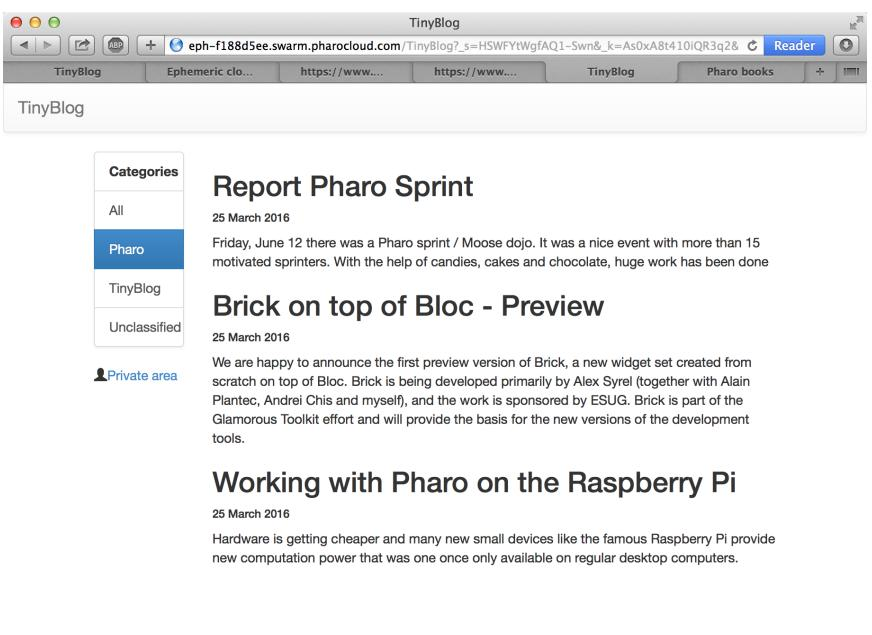

**Figure 1-1** The TinyBlog application.

<span id="page-9-2"></span>Finally, to help you to get over possible errors and avoid to get stuck, the last chapter describes how to load the code described in each chapter.

### <span id="page-9-0"></span>1.2 **Pharo Installation**

In this tutorial, we suppose that you are using the Pharo MOOC image (it is currently a Pharo 8.0 image) in which many frameworks and web libraries have been loaded: Seaside (component-based web application server), Magritte (an automatic generation report system based on descriptions), Bootstrap (a library to visually tune web applications), Voyage (a framework to save your objects in document databases) and some others.

You can get the Pharo MOOC image using the Pharo Launcher ([http://pharo.](http://pharo.org/download) [org/download](http://pharo.org/download)).

#### <span id="page-9-1"></span>1.3 **Naming Rules**

In the following, we prefix all the class names TB (for TinyBlog). You may:

• either choose another prefix (by example TBM) to be able to load the solution side by side to your own. This way you will be able to compare the two solutions,

• either choose the same prefix to fusion the proposed solutions in your code. The merge tool will help you see the differences and learn from the changes. This solution may be more complex if you implement your own extra functionalities.

# <span id="page-10-0"></span>1.4 **Resources**

Pharo has many strong pedagogial resources as well as a super friendly community of users. Here is a list of resources:

- <http://books.pharo.org> proposes books around Pharo. Pharo by Example can help you to discove the language and its libraries. Entreprise Pharo: a Web Perspective presents other aspects useful for web development.
- <http://book.seaside.st> is one of the books on Seaside. It is currently under migration as an open-source book [https://github.com/SquareBracketA](https://github.com/SquareBracketAssociates/DynamicWebDevelopmentWithSeaside)ssociates/ [DynamicWebDevelopmentWithSeaside](https://github.com/SquareBracketAssociates/DynamicWebDevelopmentWithSeaside).
- <http://mooc.pharo.org> proposes an excellent Mooc with more that 90 videos explaining syntactically points as well as object programming key concepts.
- A discord channel where many Pharoers exchange information and help each other is accessible here: <http://www.pharo.org/community>

# **C H A P T E R 2**

# <span id="page-12-0"></span>TinyBlog Application: Core model

In this chapter, we start to develop a part of the domain model of TinyBlog. The model is particularly simple: it starts with a post. In the next chapter we will add a blog containing a list of posts.

# <span id="page-12-1"></span>2.1 **TBPost Class**

We start with the post representation. It is super simple as shown by Figure [2-1.](#page-12-2) It is defined by the class TBPost:

```
Object subclass: #TBPost
   instanceVariableNames: 'title text date category visible'
   classVariableNames: ''
   package: 'TinyBlog'
```
A blog post is described by 5 instance variables.

| Post           |
|----------------|
| visible        |
| date           |
| title          |
| text           |
| category       |
| isVisible      |
| isUnclassified |

<span id="page-12-2"></span>**Figure 2-1** TBPost: a really basic class mostly handling data.

| Variable | Signification                        |
|----------|--------------------------------------|
| title    | post title                           |
| text     | post text                            |
| date     | date of writing                      |
| category | name of the category of the post     |
| visible  | is the post publicly visible or not? |

All of these variables have corresponding accessor methods in the 'accessing' protocol. You can use a refactoring to automatically create all the following methods:

```
TBPost >> title
   ^ title
TBPost >> title: aString
   title := aString
TBPost >> text
   ^ text
TBPost >> text: aString
   text := aString
TBPost >> date
   ^ date
TBPost >> date: aDate
   date := aDate
TBPost >> visible
   ^ visible
TBPost >> visible: aBoolean
   visible := aBoolean
TBPost >> category
   ^ category
TBPost >> category: anObject
   category := anObject
```
#### <span id="page-13-0"></span>2.2 **Post Visibility**

We should add methods to make a post visible or not and also test if it is visible. Those methods are defined in the 'action' protocol.

```
TBPost >> beVisible
   self visible: true
TBPost >> notVisible
   self visible: false
```
2.3 Initialization

# 2.3 **Initialization**

<span id="page-14-0"></span>The initialize method ('initialization' protocol) sets the date to the current day and the visibility to false: the user must explicitly make a post visible. This allows him to write drafts and only publish a post when the post is finished. By default, a post belongs to the 'Unclassified' category that we define at the class level. This category name is defined on class-side by the unclassifiedTag method.

```
TBPost class >> unclassifiedTag
   ^ 'Unclassified'
```
Pay attention the method unclassifiedTag should be defined on the classside of the class TBPost (click on the class button to define it). The other methods are defined on the instance-side: it means that they will be applied to TBBlog instances.

```
TBPost >> initialize
  super initialize.
  self category: TBPost unclassifiedTag.
  self date: Date today.
  self notVisible
```
In the solution above, it would be better that the initialize method does not hard code the reference to the TBPost class. Propose a solution. The sequence 3 of the week 6 of the Mooc can help you to understand why it is better to avoid hardcoding class references (See <http://mooc.pharo.org>).

# <span id="page-14-1"></span>2.4 **Posts Creation Methods**

On class-side, we add class methods (i.e. methods execute on class) to ease posts creation for blogs - usually such kind of methods are grouped in the protocol 'instance creation'.

We define two methods.

```
TBPost class >> title: aTitle text: aText
   ^ self new
        title: aTitle;
        text: aText;
        yourself
TBPost class >> title: aTitle text: aText category: aCategory
   ^ (self title: aTitle text: aText)
            category: aCategory;
            yourself
```

| 0 0<br>O                                                                                                                                                                                                              |                                                                                                                                  | TinyBlogSolutionForChapter2.image |                                                                                                                                                     |                 |
|-----------------------------------------------------------------------------------------------------------------------------------------------------------------------------------------------------------------------|----------------------------------------------------------------------------------------------------------------------------------|-----------------------------------|-----------------------------------------------------------------------------------------------------------------------------------------------------|-----------------|
| TBPost class>>#title:text:category:<br>============================================================================================================================================================================== |                                                                                                                                  | V                                 | Playground<br>× - □                                                                                                                                 | 6) ?<br>-       |
| Scoped Variable                                                                                                                                                                                                       | ▼ 400<br>History Navigator                                                                                                       |                                   | Page                                                                                                                                                | 구   + =         |
| V<br>C TBPost<br>Tiny<br>A<br>& Work<br>▼ □ TinyBlog<br>TinyBlog<br>Tests<br>A Hier C Clas ? Con<br>V<br>A<br>title: aTitle text: aText category: aCategory<br>^ (self title: aTitle text: aText)                     | -- all --<br>title:text:<br>title:text:category:<br>constants<br>instance creation<br>unclassifiedTag                            |                                   | TBPost<br>title: 'Welcome in TinyBlog'<br>text: 'TinyBlog is a small blog engine made with<br>Pharo and Seaside'<br>category: 'TinyBlog'            |                 |
| category: aCategory;<br>yourself<br>1/4 (1)                                                                                                                                                                           | × -<br>a TBPost<br>Meta<br>Raw                                                                                                   |                                   | Inspector on a TBPost                                                                                                                               | ತಿ<br>? ▼<br>মু |
|                                                                                                                                                                                                                       | Variable<br>c self<br>テ<br>category<br>D<br>2<br>date<br>D<br>A<br>1<br>text<br>T<br>title<br>visible<br>C<br>"a TBPost"<br>self |                                   | Value<br>a TBPost<br>'TinyBlog'<br>6 August 2018<br>'TinyBlog is a small blog engine made with Pharo and Seaside'<br>'Welcome in TinyBlog"<br>false |                 |

<span id="page-15-2"></span>**Figure 2-2** Inspector on a TBPost instance.

#### 2.5 **Creating a Post**

<span id="page-15-0"></span>Let us create posts to check a bit the created objects. Using the Playground tools execute the following expression:

```
TBPost
  title: 'Welcome in TinyBlog'
  text: 'TinyBlog is a small blog engine made with Pharo.'
  category: 'TinyBlog'
```
When you inspect the code above (right click and "Inspect it"), you will obtain an inspector on the newly created object as shown in Figure [2-2.](#page-15-2)

### <span id="page-15-1"></span>2.6 **Adding Some Unit Tests**

Manually looking at objects is not a way to systematically verifying that such objects follow some expected invariant. Even though the model is quite simple we can define some tests. In Test Driven Developpement mode we write test first. Here we prefered to let you define a little class to familiarize with the IDE. Let us fix this!

We define the class TBPostTest (as subclass of the class TestCase).

2.7 Post Queries

```
TestCase subclass: #TBPostTest
  instanceVariableNames: ''
  classVariableNames: ''
  package: 'TinyBlog-Tests'
```
Let us define a two tests.

```
TBPostTest >> testWithoutCategoryIsUnclassified
  | post |
  post := TBPost
    title: 'Welcome to TinyBlog'
    text: 'TinyBlog is a small blog engine made with Pharo.'.
  self assert: post title equals: 'Welcome to TinyBlog' .
  self assert: post category = TBPost unclassifiedTag.
TBPostTest >> testPostIsCreatedCorrectly
    | post |
    post := TBPost
      title: 'Welcome to TinyBlog'
      text: 'TinyBlog is a small blog engine made with Pharo.'
      category: 'TinyBlog'.
    self assert: post title equals: 'Welcome to TinyBlog' .
```
<span id="page-16-0"></span>Your tests should pass.

made with Pharo.' .

## 2.7 **Post Queries**

In the protocol 'testing', define the following methods that checks whether a post is visible, and whether it is classified or not.

self assert: post text equals: 'TinyBlog is a small blog engine

```
TBPost >> isVisible
   ^ self visible
TBPost >> isUnclassified
   ^ self category = TBPost unclassifiedTag
```
It is not really good to hardcode a reference to the class TBPost in a method body. Propose a solution.

In addition, let us take the time to update our test to take advantage of the new behavior.

```
TBPostTest >> testWithoutCategoryIsUnclassified
  | post |
  post := TBPost
    title: 'Welcome to TinyBlog'
    text: 'TinyBlog is a small blog engine made with Pharo.'.
```

```
self assert: post title equals: 'Welcome to TinyBlog' .
self assert: post isUnclassified.
self deny: post isVisible
```
### <span id="page-17-0"></span>2.8 **Conclusion**

We develop a first part of the model (the class TBPost) and some tests. We strongly suggest writing some other unit tests to make sure that your model fully work.

# **C H A P T E R 3**

# <span id="page-18-0"></span>TinyBlog: Extending and Testing the Model

In this chapter we extend the model and add more tests. Note that when you will get fluent in Pharo, you will tend to write first your tests and then execute tests to code in the debugger. We did not do it because coding in the debugger requires more explanation. You can see such a practice in the Mooc video entitled *Coding a Counter in the Debugger* (See <http://mooc.pharo.org>) and read the book *Learning Object-Oriented Programming, Design with TDD in Pharo* (<http://books.pharo.org>).

Before starting, use back the code of the previous chapter or use the information of Chapter **??**.

# <span id="page-18-1"></span>3.1 **TBBlog class**

We develop the class TBBlog that contains posts (as shown by Figure [3-1\)](#page-18-2). We define some unit tests.

Here is its definition:

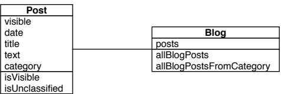

<span id="page-18-2"></span>**Figure 3-1** TBBlog: A simple class containing posts.

```
Object subclass: #TBBlog
   instanceVariableNames: 'posts'
   classVariableNames: ''
   package: 'TinyBlog'
```
We initialize the posts instance variable to an empty collection.

```
TBBlog >> initialize
   super initialize.
   posts := OrderedCollection new
```
### <span id="page-19-0"></span>3.2 **Only One Blog Object**

In the rest of this project, we assume that we will manage only one blog. Later, you may add the possibility to manage multiple blogs such as one per user of the TinyBlog application. Currently, we use a Singleton design pattern on the TBBlog class. However pay attention since this pattern introduces a kind of global variable in your application and brings less modularity to your system. Therefore avoid to make explicit references to the singleton, better use an instance variable whose value first refers to the singleton so that later you can pass another object without being forced to rewrite everything. Do not generalize what we are doing for this class.

Since all the management of a singleton is a class behavior, we define such methods at the class level of TBBlog. We define an instance variable at the class level:

```
TBBlog class
   instanceVariableNames: 'uniqueInstance'
```
Then we define two methods to manage the singleton.

```
TBBlog class >> reset
   uniqueInstance := nil
TBBlog class >> current
   "answer the instance of the TBRepository"
   ^ uniqueInstance ifNil: [ uniqueInstance := self new ]
```
We redefine the class method initialize so that when the class is loaded in memory the singleton got reset.

```
TBBlog class >> initialize
   self reset
```
#### 3.3 **Testing the Model**

We now adopt a Test-Driven Development approach i.e., we will write a unit test first and then develop the functionality until the test is green. We will repeat this process for each functionality of the model.

We create unit tests in the TBBlogTest class that belongs to the TinyBlog-Tests tag. A tag is just a label to sort classes inside a package (See menu item 'Add Tag...'). We use a tag because using two packages will make this project more complex. However, while implementing a real application, it is recommended to have one (or multiple) separate test packages.

```
TestCase subclass: #TBBlogTest
   instanceVariableNames: 'blog post first'
   classVariableNames: ''
   package: 'TinyBlog-Tests'
```
Before each test execution, the setUp method initializes the test context (also called test fixture). For example, it erases the blog content, adds one post and creates another temporary post that is not saved.

Pay attention since we will have to modify such behavior in the future else each time we will run the test we will destroy our data. This is an example of the kind of insidious behavior that a singleton introduces.

```
TBBlogTest >> setUp
   blog := TBBlog current.
   blog removeAllPosts.
   first := TBPost title: 'A title' text: 'A text' category: 'First
    Category'.
   blog writeBlogPost: first.
   post := (TBPost title: 'Another title' text: 'Another text'
    category: 'Second Category') beVisible
```
As you may notice, we test different configurations. Posts do not belong to the same category, one is visible and the other is not visible.

At the end of each test, the tearDown method is executed and resets the blog.

```
TBBlogTest >> tearDown
   TBBlog reset
```
Here we see one of the limits of using a Singleton. Indeed, if you deploy a blog and then execute the tests, you will lose all posts that have been created because we reset the Blog singleton. We will address this problem in the future.

We will now develop tests first and then implement all functionalities to make them green.

# <span id="page-20-0"></span>3.4 **A First Test**

The first test adds a post in the blog and verifies that this post is effectivly added.

```
TBBlogTest >> testAddBlogPost
   blog writeBlogPost: post.
   self assert: blog size equals: 2
```
If you try to execute it, you will notice that this test is not green (does not pass) because we did not define the methods writeBlogPost:, removeAll-Posts and size. Let's add them:

```
TBBlog >> removeAllPosts
   posts := OrderedCollection new
TBBlog >> writeBlogPost: aPost
   "Add the blog post to the list of posts."
   posts add: aPost
TBBlog >> size
   ^ posts size
```
<span id="page-21-0"></span>The previous test should now pass (i.e. be green).

## 3.5 **Increasing Test Coverage**

We should also add tests to cover all functionalities that we introduced.

```
TBBlogTest >> testSize
   self assert: blog size equals: 1
TBBlogTest >> testRemoveAllBlogPosts
   blog removeAllPosts.
   self assert: blog size equals: 0
```
# <span id="page-21-1"></span>3.6 **Other Functionalities**

We follow the test-driven way of defining methods: First we define a test. Then we verify that this test is failing. Then we define the method under test and finally verify that the test passes.

#### **All Posts**

Let's a test that fails:

```
TBBlogTest >> testAllBlogPosts
   blog writeBlogPost: post.
   self assert: blog allBlogPosts size equals: 2
```
And the model code that makes it succeed:

TBBlog >> allBlogPosts ^ posts

Your test should pass.

#### **Visible Posts**

We define a new unit test accessing visible blogs:

```
TBBlogTest >> testAllVisibleBlogPosts
   blog writeBlogPost: post.
   self assert: blog allVisibleBlogPosts size equals: 1
```
We add the corresponding method:

```
TBBlog >> allVisibleBlogPosts
   ^ posts select: [ :p | p isVisible ]
```
Verify that the test passes.

#### **All Posts of a Category**

The following test verifies that we can access all the posts of a given category. Once defined, we should make sure that the test failed.

```
TBBlogTest >> testAllBlogPostsFromCategory
   self assert: (blog allBlogPostsFromCategory: 'First Category')
    size equals: 1
```
Then we can define the functionality and make sure that our test passes.

```
TBBlog >> allBlogPostsFromCategory: aCategory
   ^ posts select: [ :p | p category = aCategory ]
```
Verify that the test passes.

#### **All visible Posts of a Category**

The following test verifies that we can access all the visible posts of a given category. Once defined, we should make sure that the test failed.

```
TBBlogTest >> testAllVisibleBlogPostsFromCategory
   blog writeBlogPost: post.
   self assert: (blog allVisibleBlogPostsFromCategory: 'First
    Category') size equals: 0.
   self assert: (blog allVisibleBlogPostsFromCategory: 'Second
    Category') size equals: 1
```
Then we can define the functionality and make sure that our test passes.

```
TBBlog >> allVisibleBlogPostsFromCategory: aCategory
  ^ posts select: [ :p | p category = aCategory
                  and: [ p isVisible ] ]
```
Verify that the test passes.

#### **Check unclassified posts**

The following test verifies that we do not have unclassified blogs in our test fixture.

```
TBBlogTest >> testUnclassifiedBlogPosts
   self assert: (blog allBlogPosts select: [ :p | p isUnclassified
    ]) size equals: 0
```
Verify that the test passes.

#### **Retrieve all categories**

Again we define a new test and verify that it fails.

```
TBBlogTest >> testAllCategories
   blog writeBlogPost: post.
   self assert: blog allCategories size equals: 2
```
We then add the new behavior.

```
TBBlog >> allCategories
   ^ (self allBlogPosts collect: [ :p | p category ]) asSet
```
<span id="page-23-0"></span>Verify that the test passes.

#### 3.7 **Testing data**

To help you testing the application, you can add the following method that creates multiple posts.

```
TBBlog class >> createDemoPosts
   "TBBlog createDemoPosts"
   self current
      writeBlogPost: ((TBPost title: 'Welcome in TinyBlog' text:
    'TinyBlog is a small blog engine made with Pharo.' category:
    'TinyBlog') visible: true);
      writeBlogPost: ((TBPost title: 'Report Pharo Sprint' text:
    'Friday, June 12 there was a Pharo sprint / Moose dojo. It was a
    nice event with more than 15 motivated sprinters. With the help
    of candies, cakes and chocolate, huge work has been done'
    category: 'Pharo') visible: true);
      writeBlogPost: ((TBPost title: 'Brick on top of Bloc -
    Preview' text: 'We are happy to announce the first preview
    version of Brick, a new widget set created from scratch on top
    of Bloc. Brick is being developed primarily by Alex Syrel
    (together with Alain Plantec, Andrei Chis and myself), and the
    work is sponsored by ESUG.
      Brick is part of the Glamorous Toolkit effort and will provide
    the basis for the new versions of the development tools.'
    category: 'Pharo') visible: true);
```
writeBlogPost: ((TBPost title: 'The sad story of unclassified blog posts' text: 'So sad that I can read this.') visible: true); writeBlogPost: ((TBPost title: 'Working with Pharo on the Raspberry Pi' text: 'Hardware is getting cheaper and many new small devices like the famous Raspberry Pi provide new computation power that was one once only available on regular desktop computers.' category: 'Pharo') visible: true)

If you inspect the result of the following snippet, you will see that the current blog contains 5 posts:

TBBlog createDemoPosts ; current

Be aware that if you execute this createDemoPosts method multiple times, your blog singleton object will contain multiple copies of these posts.

# <span id="page-24-0"></span>3.8 **Possible Extensions**

Many extensions can be made such as: retrieve the list of categories that contains at least one visible post, delete a category and all posts that it contains, rename a category, move a post from one category to another, make (in)visible one category and all its content, etc. We encourage you to develop some of them.

# <span id="page-24-1"></span>3.9 **Conclusion**

You now have the full model of TinyBlog as well as some unit tests. You are now ready to implement more advanced functionality such as the database storage or a first Web front-end. Do not forget to save your code.

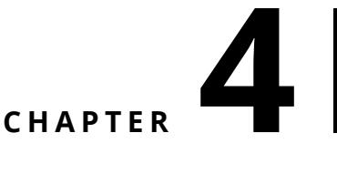

# <span id="page-26-0"></span>Data Persitency using Voyage and Mongo

Until now we used model objects stored in memory and it works well because saving the Pharo image also saves these objects. Nevertheless, it would be better to save these objects (blog posts) into an external database. Pharo supports multiple object serializers such Fuel (binary format) or STON (text format). These serializers are useful and powerful. Often with a single line of code we can save a full graph on objects as explained in the Enterprise Pharo book available at <http://books.pharo.org>.

In this chapter, we will use another possibility: saving data in a document database such as Mongo (<https://www.mongodb.com>) using the Voyage framework. Voyage provides a unified API to store and retrieve objects in various document-based databases such as Mongo or UnQLite. But first, we will use Voyage and its capacity to simulate an external database in memory. This is really useful during development. Then, you may install a local Mongo database and access it through Voyage. As you will see, this second step will have a really little impact on our code.

<span id="page-26-1"></span>The last chapter explains how to load the code of previous chapters if needed.

# 4.1 **Configure Voyage to Save TBBlog Objects**

By defining the class method isVoyageRoot, we declare that objects of this class must be saved into the database as root objects. It means that the database will contain as many documents as instances of this class.

```
TBBlog class >> isVoyageRoot
   "Indicates that instances of this class are top level documents
    in noSQL databases"
   ^ true
```
We should establish connection to real database or work in memory. Let's start to work in memory by using this expression:

VOMemoryRepository new enableSingleton.

The enableSingleton message indicates to Voyage that we will use only one database. This will free us to specify the database each time. We create and initialize the database in memory in a class-side method named initializeVoyageOnMemoryDB.

```
TBBlog class >> initializeVoyageOnMemoryDB
   VOMemoryRepository new enableSingleton
```
The reset class method re-initializes the database. The initialize class method ensures that the database is initialized when we load TinyBlog's code. Do not forget to execute this expression TBBlog initialize to ensure that the database is initialized.

```
TBBlog class >> reset
      self initializeVoyageOnMemoryDB
TBBlog class >> initialize
      self reset
```
The class-side current method is trickier. Before using Voyage, we implemented a simple singleton pattern (TBBlog current). However, it does not work anymore because imagine that we saved our blog and that the server stopped by accident or that we would reload a new version of the code, it would re-initialize the connection and create a new fresh instance of the blog. It would then be possible to end up with a different instance than the saved one.

So we change the implementation of the current class method to make a database request and retrieve saved objects. Since we only save one blog object, it only consists in doing: self selectOne: [ :each | true ] or self selectAll anyOne. If the database contains no instance, we create a new one and save it.

```
TBBlog class >> current
   ^ self selectAll
      ifNotEmpty: [ :x | x anyOne ]
      ifEmpty: [ self new save ]
```
We can also remove the class instance variable named uniqueInstance that we previously used to store our singleton object.

```
TBBlog class
  instanceVariableNames: ''
```
4.2 Saving a Blog

## 4.2 **Saving a Blog**

<span id="page-28-0"></span>Each time we modify a blog object, we must propagate changes into the database. For example, we modify the writeBlogPost: method to save the blog when we add a new post.

```
TBBlog >> writeBlogPost: aPost
  "Write the blog post in database"
  self allBlogPosts add: aPost.
  self save
```
We also save the blog when removing (remove method) a post from a blog.

```
TBBlog >> removeAllPosts
  posts := OrderedCollection new.
  self save.
```
# <span id="page-28-1"></span>4.3 **Revising Unit Tests**

We now save blogs in a database, either in memory or in an external Mongo server, through Voyage. We must be careful with unit tests that modify the database because they may corrupt production data. To circumvent this dangerous situation, a test should not modify the state of the system.

To solve this situation, before running a test we will keep a reference to the current blog and create a new context and restore it after test execution.

Let's add an instance variable previousRepository in the TBBLogTest class.

```
TestCase subclass: #TBBlogTest
  instanceVariableNames: 'blog post first previousRepository'
  classVariableNames: ''
  package: 'TinyBlog-Tests'
```
Then, we modify the setUp method to save the database before each test execution. We create a temporary database object that will be used by the test.

```
TBBlogTest >> setUp
  previousRepository := VORepository current.
  VORepository setRepository: VOMemoryRepository new.
  blog := TBBlog current.
  first := TBPost title: 'A title' text: 'A text' category: 'First
    Category'.
  blog writeBlogPost: first.
  post := (TBPost title: 'Another title' text: 'Another text'
    category: 'Second Category') beVisible
```
In the tearDown method executed after each test, we restore the original database object.

```
TBBlogTest >> tearDown
  VORepository setRepository: previousRepository
```
## 4.4 **Querying the Database**

The database is currently in memory and we can access to the blog object using the current class-side method of the TBBlog class. It is enough to show the API of Voyage since it will be the same to access a real Mongo database.

You can create posts:

TBBlog createDemoPosts

You can count the number of blog saved. count is part of the Voyage API. In this example, we get the result 1 because the blog is implemented as a Singleton.

```
TBBlog count
>1
```
Similarly, you can retrieve all saved root objects of one kind.

```
TBBlog selectAll
```
You can also remove a root objet using the remove message.

You can discover more about the Voyage API by looking at:

- the Class class,
- the VORepository class which is the root of the hierarchy of all databases either in memory or external.

<span id="page-29-1"></span>Those queries will be more relevant with more objects but they would be similar.

#### 4.5 **If we would Save Posts [Discussion]**

This section should not be implemented. It is only described as an example (More information about Voyage can be found in the Enterprise Pharo book <http://books.pharo.org>). We want to illustrate that declaring a class as a Voyage root has an influence on how an instance of this class is saved and reloaded.

So far, a post (an instance of TBPost) is not declared as a Voyage root. Post objects are therefore saved as sub-parts into the blog object they belong to. It implies that a post is not guaranteed to be unique after saving and reloading from the database. Indeed, after loading each blog objects will have their own posts objects even if some posts were shared before saving. Shared objects before saving will be duplicated for each root objects after loading.

We can declare posts as root objects meaning that a post can be saved independently from a blog. It implies that saved blogs have a reference to a TBPost object. This would preserve posts sharing between blog objects.

However, not all objects should be root objects. If we represent post comments, we would not define them as root objects too because manipulating a comment outside of its context (a post) does not make sense.

#### **Post as Root = Uniqueness**

If you want to share posts and make them unique between multiple blogs, therefore, the TBPost class must be declared as a root in the database. In this case, posts are saved as autonomous entities and instances of TBBlog will reference posts entities instead of embedding them. The consequence is that a post is unique and can be shared via reference from a blog. To achieve this, we **would** define the following methods:

```
TBPost class >> isVoyageRoot
   "Indicates that instances of this class are top level documents
    in noSQL databases"
   ^ true
```
During the addition of a post to a blog, it would be important to save both the blog and the new post.

```
TBBlog >> writeBlogPost: aPost
   "Write the blog post in database"
   posts add: aPost.
   aPost save.
   self save
TBBlog >> removeAllPosts
   posts do: [ :each | each remove ].
   posts := OrderedCollection new.
   self save.
```
In the removeAllPosts method, we first remove all posts, then update the collection and finally save the blog.

# <span id="page-30-0"></span>4.6 **Configure an External Mongo Database [Optional]**

By using Voyage, we can easily save our model objects into a Mongo database. This section explains how to proceed and the few modifications to make into our code. This is not mandatory to do it. Even if you do it, we encourage you to continue to work with a memory database afterwards.

#### **Installing Mongo**

Regardless of your operating system (Linux, MacOS or Windows), you can install a local Mongo server on your machine (cf. <https://www.mongodb.com>). This is useful to test your application without requiring an internet connection. Instead directly installing Mongo, we suggest to install Docker ([https:](https://www.docker.com) [//www.docker.com](https://www.docker.com)) on your machine and execute a Mongo container using the following command line:

```
docker run --name mongo -p 27017:27017 -d mongo
```
**Note** The running Mongo server must not use authentication (it is not the case with the default installation) because the new SCRAM authentication mechanism used by Mongo 3.0 is currently not supported by Voyage.

Some useful Docker commands:

```
# to stop your Mongo docker container
docker stop mongo
# to re-start your container
docker start mongo
# to delete your container (it must be stopped before)
docker rm mongo
```
#### **Connecting a Local Mongo Server**

Once installed, you can connect to a Mongo server directly from Pharo. We define the method named initializeLocalhostMongoDB to establish the connection to the local Mongo server (localhost, default port) and access the database named 'tinyblog'.

```
TBBlog class >> initializeLocalhostMongoDB
   | repository |
   repository := VOMongoRepository database: 'tinyblog'.
   repository enableSingleton.
```
Reset the class to set a new connection to the database.

```
TBBlog class >> reset
   self initializeLocalhostMongoDB
```
Now, if you recreate demo posts, they are automatically saved into your local Mongo database:

TBBlog reset. TBBlog createDemoPosts

## **In Case of Trouble**

If you need to re-initialize completely an external database, you can use the dropDatabase method.

```
(VOMongoRepository
   host: 'localhost'
   database: 'tinyblog') dropDatabase
```
You can also do it in command line when mongod is running with:

```
mongo tinyblog --eval "db.dropDatabase()"
```
or by connecting to the docker container it is running in:

```
docker exec -it mongo bash -c 'mongo tinyblog --eval
    "db.dropDatabase()"'
```
### **Points of Attention: Changing TBBlog Definition**

When you use an external Mongo database instead of a memory one, each time you add new root objects or modify the definition of some root objects, it is important to reset the cache maintained by Voyage. It can be done using:

<span id="page-32-0"></span>VORepository current reset

# 4.7 **Conclusion**

Voyage proposes a nice API to transparently manage storage of objects either into memory or in a document database. Application data are now saved into a database and we are ready to build the web user interface.

# **C H A P T E R 5**

# <span id="page-34-0"></span>First Steps with Seaside

In this chapter, we will setup Seaside and build our first Seaside component. In the next chapters, we will develop the public part of TinyBlog, then the authentication system, followed by the administration part reserved to blog administrators.

All along, we will define Seaside components <http://www.seaside.st>. A reference book is available online <http://book.seaside.st> and the firsts chapters may help you and be a great companion of this tutorial book.

All the following work is independent of Voyage and the Mongo database. As usual, you can download the code of previous chapters as explained in the last chapter.

|                                                                                           | Seaside Control Panel                           |        |
|-------------------------------------------------------------------------------------------|-------------------------------------------------|--------|
|                                                                                           | ZnZincServerAdaptor zinc on port 8080 [running] |        |
|                                                                                           |                                                 |        |
| Start                                                                                     | Stop                                            | Browse |
| Type: ZnZincServerAdaptor<br>Port: 8080<br>Encoding: utf-8<br>zinc on port 8080 [running] |                                                 |        |

<span id="page-34-1"></span>**Figure 5-1** Starting the Seaside server.

| Welcome to Seaside 3.1                                                             | 0                            |
|------------------------------------------------------------------------------------|------------------------------|
| 1 1 1 0 + K localhost:8080                                                         | C Reader                     |
| Welcome to Seaside 3.1                                                             | +                            |
| Welcome to Seaside 3.1<br>Congratulations, you have a working Seaside environment. | Search   the Seaside site    |
| Getting started                                                                    | Join the community           |
| Test the water with the steps below:                                               | Join the mailing list to ask |
| 1. Try out some examples                                                           | questions and get help.      |
| · Counter, a simple Seaside component.                                             | Search   the mailing list    |
| · Multi-Counter, showing how Seaside components can be re-used.                    | Diving In                    |
| · Task, illustrating Seaside's innovative approach to application control flow.    | Browse the applications      |
| 2. Create your first component                                                     | installed in your image.     |
| Name your component: MyFirstComponent                                              | Configure your Seaside       |
| Create                                                                             | development environment.     |
| 3. Browse the documentation                                                        | Check out examples of        |
| · The Seaside Book will teach you all you need to know about Seaside and how       | Seaside's JQuery and JQuery  |
| to build killer web applications.                                                  | Ul integration.              |
| · The Seaside Tutorial has 12 chapters and introduces a sample application to      | Seaside 3.1 changes          |
| explain the main features of Seaside.                                              | Seaside add-on libraries     |

<span id="page-35-2"></span>**Figure 5-2** Running Seaside.

#### 5.1 **Starting Seaside**

<span id="page-35-0"></span>Seaside should be already loaded in your PharoWeb image. If not, please refer to the loading chapter.

There are two ways to start Seaside. The first one consists in executing the following snippet:

```
ZnZincServerAdaptor startOn: 8080.
```
The second one uses the graphical tool named "Seaside Control Panel" (Tools Menu>Seaside Control Panel). In the contextual menu (right clic) of this tool, select "add adaptor..." and add a server of type ZnZincServerAdaptor, then define the port number (e.g. 8080) it should run on (cf. Figure [5-1\)](#page-34-1). By opening a web browser on the URL <http://localhost:8080>, you should see the Seaside home page as displayed on Figure [5-2.](#page-35-2)

#### <span id="page-35-1"></span>5.2 **Bootstrap for Seaside**

The Bootstrap library is directly accessible from Pharo and Seaside. The repository and the documentation of Bootstrap for Pharo is available there: <https://github.com/astares/Seaside-Bootstrap4>. But it is already loaded into the PharoWeb image we are using with this book.

You can browse the examples locally in your browser by clicking on the **bootstrap** link in the list of applications hosted by Seaside or directly enter

#### 5.3 Define our Application Entry Point

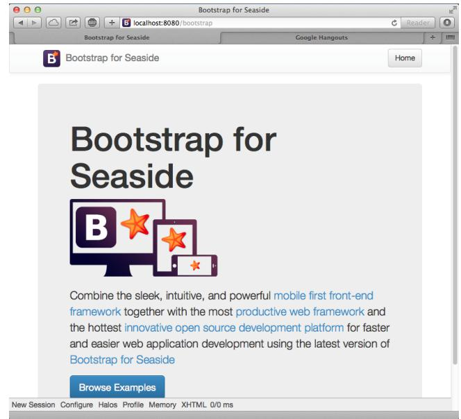

**Figure 5-3** Browsing the Seaside Bootstrap Library.

<span id="page-36-1"></span>this URL <http://localhost:8080/bootstrap>. You should see Bootstrap examples as shown in Figure [5-3.](#page-36-1)

By clicking on the **Examples** link at the bottom of the page, you can see both Bootstrap graphical elements and the Seaside code needed to obtain them (cf. Figure [5-4\)](#page-37-0).

# <span id="page-36-0"></span>5.3 **Define our Application Entry Point**

Create a class named TBApplicationRootComponent which will be the entry point of the application.

```
WAComponent subclass: #TBApplicationRootComponent
   instanceVariableNames: ''
   classVariableNames: ''
   package: 'TinyBlog-Components'
```
We register the TinyBlog application into the Seaside application server by defining the initialize class method into the 'initialization' protocol. We also integrate dependencies to the Bootstrap framework (CSS and JS files will be embedded in the application).

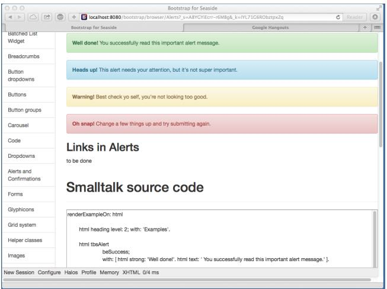

<span id="page-37-0"></span>**Figure 5-4** A Bootstrap element and its code.

```
TBApplicationRootComponent class >> initialize
   "self initialize"
   | app |
   app := WAAdmin register: self asApplicationAt: 'TinyBlog'.
   app
      addLibrary: JQDeploymentLibrary;
      addLibrary: JQUiDeploymentLibrary;
      addLibrary: TBSDeploymentLibrary
```
Once declared, you should execute this method with TBApplicationRoot-Component initialize. Indeed, class-side initialize methods are executed at loading-time of a class but since the class already exists, we must execute it by hand.

We also add a method named canBeRoot to specify that TBApplication-RootComponent is not a simple Seaside component but a complete application. This component will be automatically instantiated when a user connects to the application.

```
TBApplicationRootComponent class >> canBeRoot
   ^ true
```
You can verify that your application is correctly registered into Seaside by connecting to the Seaside server through your web browser, click on "Browse the applications installed in your image" and then see that TinyBlog appears in the list as illustrated on Figure [5-5.](#page-38-1) Alternatively, you can visit [http:](http://localhost:8080/TinyBlog) [//localhost:8080/TinyBlog](http://localhost:8080/TinyBlog).

| 900                |                    | Dispatcher at / | 15 of            |
|--------------------|--------------------|-----------------|------------------|
|                    | 4 >   2   @   =    |                 | 0<br>ಲ<br>Reader |
|                    |                    | Dispatcher at / | +                |
|                    |                    |                 |                  |
| seaside            |                    |                 |                  |
|                    |                    |                 |                  |
|                    |                    |                 |                  |
|                    |                    |                 |                  |
| Dispatcher at /    |                    |                 |                  |
| . /                | Dispatcher         |                 |                  |
| TinyBlog           | Application        |                 |                  |
| bootstrap          | Application        |                 |                  |
| bootstrap-examples | Application        |                 |                  |
| browse             | Application        |                 |                  |
| config             | Application        |                 |                  |
| examples /         | Dispatcher         |                 |                  |
| files              | File Library       |                 |                  |
| javascript/        | Dispatcher         |                 |                  |
| magritte/          | Dispatcher         |                 |                  |
| seaside            | Legacy redirection |                 |                  |
| status             | Application        |                 |                  |
| tests/             | Dispatcher         |                 |                  |
| tools/             | Dispatcher         |                 |                  |
| welcome            | Application        |                 |                  |
|                    |                    |                 |                  |

**Figure 5-5** TinyBlog is a registered Seaside application.

<span id="page-38-1"></span>

| ●●●                                           | Seaside |  |
|-----------------------------------------------|---------|--|
| ◀ ▷ △ 온 [ - ®   + ( ® localhost:8080/TinyBlog |         |  |
|                                               | Seaside |  |
| TinyBlog                                      |         |  |

<span id="page-38-2"></span>**Figure 5-6** A first Seaside web page.

#### 5.4 **First Simple Rendering**

<span id="page-38-0"></span>Let's add an instance method named renderContentOn: in rendering protocol to make our application displaying something.

```
TBApplicationRootComponent >> renderContentOn: html
   html text: 'TinyBlog'
```
If you open <http://localhost:8080/TinyBlog> in your web browser, the page should look like the one on Figure [5-6.](#page-38-2)

You can customize the web page header and declare it as HTML 5 compliant by redefining the updateRoot: method.

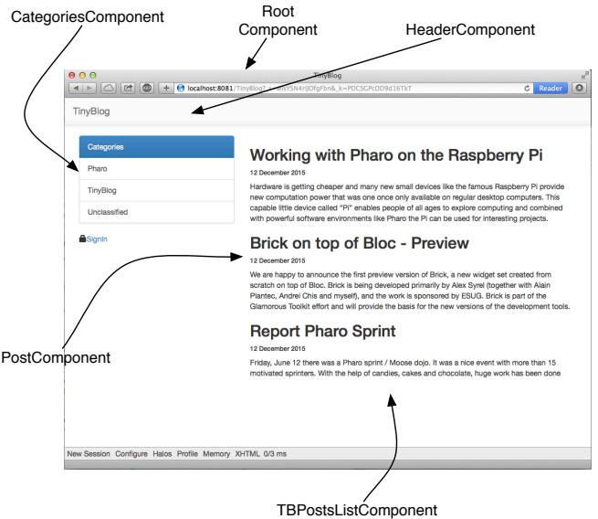

<span id="page-39-1"></span>**Figure 5-7** Main components of TinyBlog (public view).

```
TBApplicationRootComponent >> updateRoot: anHtmlRoot
   super updateRoot: anHtmlRoot.
   anHtmlRoot beHtml5.
   anHtmlRoot title: 'TinyBlog'
```
The title: message is responsible for setting the page title, as can be seen in your web browser's title bar. The TBApplicationRootComponent component is the root component of our application. It will not display a lot of things. In the following, it will contain and display other components. For example, a component to display posts to the blog readers, a component to administrate the blog and its posts, ...

#### <span id="page-39-0"></span>5.5 **Architecture**

We are now ready to define the visual components of our web application.

#### **Overview of TinyBlog**

Figure [6-2](#page-43-0) shows an overview of them and their responsibilities while Figure [5-8](#page-40-1) shows the general architecture of our application and the relations between those components.

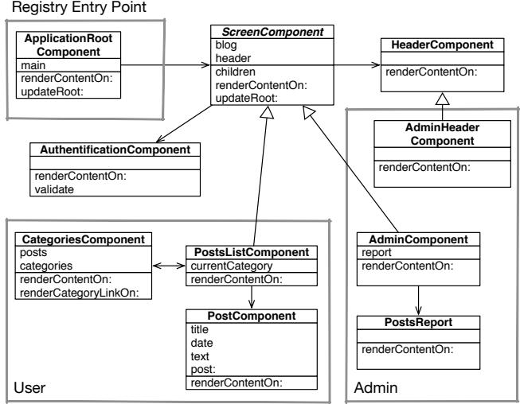

<span id="page-40-1"></span>**Figure 5-8** Architecture of TinyBlog.

#### **Description of the Main Components**

To ease your understanding of the incremental development of this application, Figure [5-8](#page-40-1) describes the targeted architecture.

- ApplicationRootComponent is the entry point registered into Seaside. This component contains components inheriting from the abstract class ScreenComponent.
- ScreenComponent is the root of the components used to build the public and administration view of the application. It is composed of a header.
- PostsListComponent is the main component that displays the posts. It is composed of instances of PostComponent) and manages categories.
- AdminComponent is the main component of the administration view. It is composed of a report component (instance of PostsReport) built using Magritte.

# <span id="page-40-0"></span>5.6 **Conclusion**

We are now ready to start the development of the described components. In the next chapters, we guide you linearly to develop those components. If you feel lost at some point, we invite you to come back on this architecture overview to better understand what we are developing.

# **C H A P T E R 6**

# <span id="page-42-0"></span>Web Components for TinyBlog

In this chapter, we build the public view of TinyBlog that displays the posts of the blog. Figure [6-1](#page-42-2) shows the components we will work on during this chapter. If you feel lost at any moment, please refer to it.

Before starting, you can load the code of previous chapters as described in the last chapter of this book.

# <span id="page-42-1"></span>6.1 **Visual Components**

Figure [6-2](#page-43-0) shows the visual components we will define in this chapter and where they will be displayed.

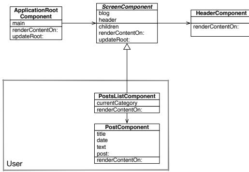

<span id="page-42-2"></span>**Figure 6-1** Component Architecture of the Public View (opposed to the Administration View).

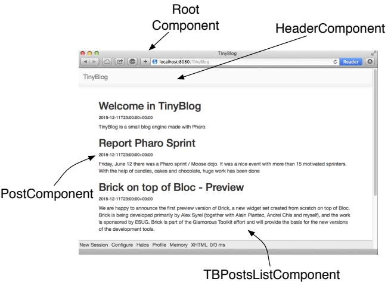

<span id="page-43-0"></span>**Figure 6-2** Visual Components of TinyBlog.

#### **The TBScreenComponent component**

All components contained in TBApplicationRootComponent will be subclasses of the abstract class TBScreenComponent. This class allows us to factorize shared behavior between all our components.

```
WAComponent subclass: #TBScreenComponent
   instanceVariableNames: ''
   classVariableNames: ''
   package: 'TinyBlog-Components'
```
All components need to access the model of our application. Therefore, in the 'accessing' protocol, we add a blog method that returns the current instance of TBBlog (the singleton). In the future, if you want to manage multiple blogs, you will modify this method and return the blog object it has been configured with.

```
TBScreenComponent >> blog
   "Return the current blog. In the future we will ask the
   session to return the blog of the currently logged in user."
   ^ TBBlog current
```
Let's define a method renderContentOn: on this new component that temporarily displays a message. If you refresh your browser, nothing appears because this new component is not displayed at all yet.

```
TBScreenComponent >> renderContentOn: html
   html text: 'Hello from TBScreenComponent'
```
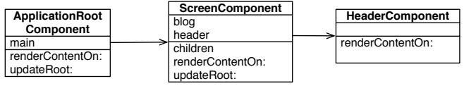

<span id="page-44-2"></span>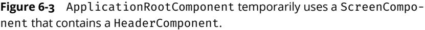

# 6.2 **Using the TBScreenComponent component**

<span id="page-44-0"></span>In the final architecture, TBScreenComponent is an abstract component and should not be used directly. Nevertheless, we will use it temporarily while developing other components.

Let's add an instance variable main in TBApplicationRootComponent class. We obtain the situation described in Figure [6-3.](#page-44-2)

```
WAComponent subclass: #TBApplicationRootComponent
  instanceVariableNames: 'main'
  classVariableNames: ''
  package: 'TinyBlog-Components'
```
We initialize this instance variable in the initialize method with a new instance of TBScreenComponent.

```
TBApplicationRootComponent >> initialize
   super initialize.
   main := TBScreenComponent new
```
We make the TBApplicationRootComponent to render this sub-component.

```
TBApplicationRootComponent >> renderContentOn: html
   html render: main
```
We do not forget to declare that the object contained in main instance variable is a sub-component of TBApplicationRootComponent by redefining the children method.

```
TBApplicationRootComponent >> children
   ^ { main }
```
Figure [6-4](#page-45-3) shows the result that you should obtain in your browser. Currently, there is only the text: Hello from TBScreenComponent displayed by the TBScreenComponent sub-component. (voir figure [6-4\)](#page-45-3).

# <span id="page-44-1"></span>6.3 **Pattern of Component Definition**

We will often use the same following steps:

• first, we define a class and the behavior of a new component;

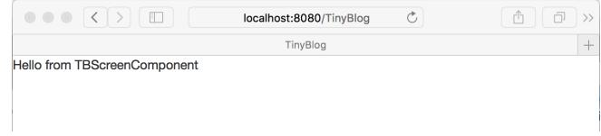

**Figure 6-4** First visual rendering of TBScreenComponent.

- <span id="page-45-3"></span>• then, we reference it from an existing component that uses it;
- and we express the composite/sub-component relationship by redefining the children method.

# <span id="page-45-0"></span>6.4 **Populating the Blog**

You can inspect the blog object returned by TBBlog current and verify that it contains some posts. You can also do it simply as:

TBBlog current allBlogPosts size

If it does not, execute:

<span id="page-45-1"></span>TBBlog createDemoPosts

# 6.5 **Definition of TBHeaderComponent**

Let's define a component named TBHeaderComponent that renders the common header of all pages of TinyBlog. This component will be inserted on the top of all components such as TBPostsListComponent. We use the pattern described above: define the class of the component, reference it from its enclosing component and redefine the children method.

Here the class definition:

```
WAComponent subclass: #TBHeaderComponent
   instanceVariableNames: ''
   classVariableNames: ''
   package: 'TinyBlog-Components'
```
# <span id="page-45-2"></span>6.6 **Usage of TBHeaderComponent**

Remember that TBScreenComponent is the (abstract) root of all components in our final architecture. Therefore, we will introduce our header into TB-ScreenComponent so that all its subclasses will inherit it. Since, it is not desirable to instantiate the TBHeaderComponent each time a component is called, we store the header in an instance variable named header.

6.7 Composite-Component Relationship

```
WAComponent subclass: #TBScreenComponent
   instanceVariableNames: 'header'
   classVariableNames: ''
   package: 'TinyBlog-Components'
```
We initialize it in the initialize method categorized in the 'initialization' protocol:

```
TBScreenComponent >> initialize
   super initialize.
   header := self createHeaderComponent
TBScreenComponent >> createHeaderComponent
   ^ TBHeaderComponent new
```
Note that we use a specific method named createHeaderComponent to create the instantiate the header component. Redefining this method makes it possible to completely change the header component that is used. We will use that to display a different header component for the administration view.

# <span id="page-46-0"></span>6.7 **Composite-Component Relationship**

In Seaside, sub-components of a component must be returned by the composite when sending it the children message. So, we must define that the TBHeaderComponent instance is a children of the TBScreenComponent component in the Seaside component hierarchy (and not in the Pharo classes hierarchy). We do so by specializing the method children. In this example, it returns a collection of one element which is the instance of TBHeaderComponent referenced by the header instance variable.

```
TBScreenComponent >> children
   ^ { header }
```
# 6.8 **Render an header**

In the renderContentOn: method ('rendering' protocol), we can now display the sub-component (the header):

```
TBScreenComponent >> renderContentOn: html
   html render: header
```
If you refresh your browser, nothing appears because the TBHeaderComponent has no rendering. Let's add a renderContentOn: method on it that displays a Bootstrap navigation header:

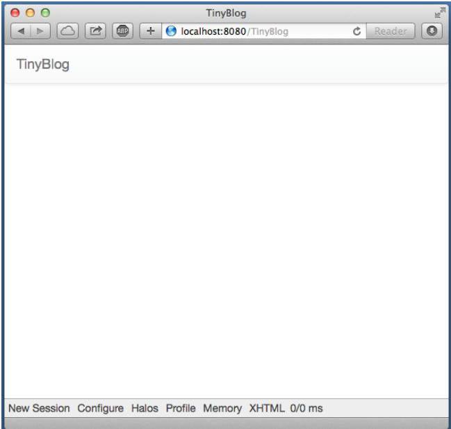

**Figure 6-5** TinyBlog with a Bootstrap header.

```
TBHeaderComponent >> renderContentOn: html
  html tbsNavbar beDefault; with: [
     html tbsContainer: [
      self renderBrandOn: html
  ]]
TBHeaderComponent >> renderBrandOn: html
   html tbsNavbarHeader: [
      html tbsNavbarBrand
         url: self application url;
         with: 'TinyBlog' ]
```
Your browser should now display what is shown on Figure [6-5.](#page-47-0) As usual in Bootstrap navigation bar, the link on the title of the application (tbsNavbarBrand) enable users to go back to home page of the application.

#### **Possible Enhancements**

The blog name should be customizable using an instance variable in the TB-Blog class and the application header component should display this title.

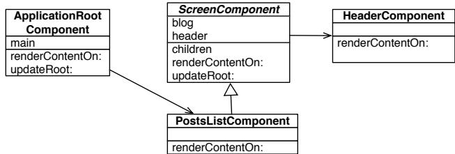

<span id="page-48-1"></span>**Figure 6-6** The ApplicationRootComponent uses PostsListComponent.

# 6.9 **List of Posts**

<span id="page-48-0"></span>Let's create a TBPostsListComponent inheriting from TBScreenComponent to display the list of all posts. Remember that we speak about the public access to the blog here and not the administration interface that will be developed later.

```
TBScreenComponent subclass: #TBPostsListComponent
   instanceVariableNames: ''
   classVariableNames: ''
   package: 'TinyBlog-Components'
```
We can now modify TBApplicationRootComponent, the main component of the application, so that it displays this new component as shown in figure [6-6.](#page-48-1) To achieve this, we modify its initialize method:

```
TBApplicationRootComponent >> initialize
   super initialize.
   main := TBPostsListComponent new
```
We add a setter method named main: to dynamically change the sub-component to display but by default it is an instance of TBPostsListComponent.

```
TBApplicationRootComponent >> main: aComponent
   main := aComponent
```
We now add a temporary renderContentOn: method (in the 'rendering' protocol) on TBPostsListComponent to test during development (cf. Figure [6-7\)](#page-49-1). In this method, we call the renderContentOn: of the super-class which renders the header component.

```
TBPostsListComponent >> renderContentOn: html
   super renderContentOn: html.
   html text: 'Blog Posts here !!!'
```
If you refresh TinyBlog in your browser, you should now see what is shown in figure [6-7.](#page-49-1)

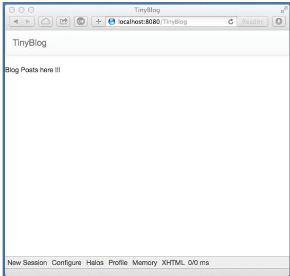

**Figure 6-7** TinyBlog displaying a basic posts list.

<span id="page-49-1"></span>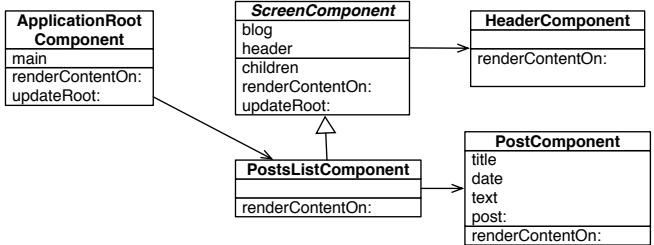

<span id="page-49-2"></span>**Figure 6-8** Using PostComponents to diplays each Posts.

## 6.10 **The PostComponent**

<span id="page-49-0"></span>Now we will define TBPostComponent to display the details of a post. Each post will be graphically displayed by an instance of TBPostComponent which will show the post title, its date and its content as shown in figure [6-8.](#page-49-2)

```
WAComponent subclass: #TBPostComponent
   instanceVariableNames: 'post'
   classVariableNames: ''
   package: 'TinyBlog-Components'
TBPostComponent >> initialize
      super initialize.
      post := TBPost new
```
6.11 Display Posts

```
TBPostComponent >> title
   ^ post title
TBPostComponent >> text
   ^ post text
TBPostComponent >> date
   ^ post date
```
The renderContentOn: method defines the HTML rendering of a post.

```
TBPostComponent >> renderContentOn: html
   html heading level: 2; with: self title.
   html heading level: 6; with: self date.
   html text: self text
```
#### **About HTML Forms**

In a future chapter on the administration view, we will show how to use Magritte to add descriptions to model objects and then use them to automatically generate Seaside components. This is powerful and free developers to manually describe forms in Seaside.

To give you a taste of that, here the equivalent code as above using Magritte:

```
TBPostComponent >> renderContentOn: html
   "DON'T WRITE THIS YET"
   html render: post asComponent
```
# <span id="page-50-0"></span>6.11 **Display Posts**

Before displaying available posts in the database, you should check that your blog contains some posts:

TBBlog current allBlogPosts size

If it contains no posts, you can recreate some:

TBBlog createDemoPosts

Now, we just need to modify the TBPostsListComponent >> renderContentOn: method to display all visible posts in the database:

```
TBPostsListComponent >> renderContentOn: html
   super renderContentOn: html.
   self blog allVisibleBlogPosts do: [ :p |
      html render: (TBPostComponent new post: p) ]
```
Refresh you web browser and you should get an error.

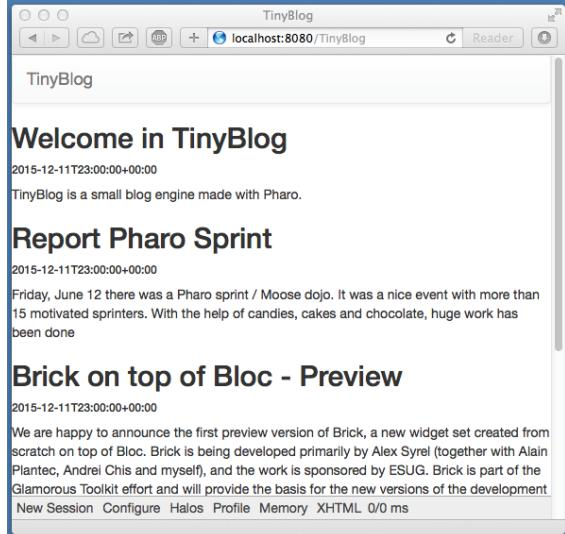

**Figure 6-9** TinyBlog with a List of Posts.

# 6.12 **Debugging Errors**

<span id="page-51-2"></span><span id="page-51-0"></span>By default, when an error occurs in a web application, Seaside returns an HTML page with the error message. You can change this message or during development, you can configure Seaside to open a debugger directly in Pharo IDE. To configure Seaside, just execute the following snippet:

```
(WAAdmin defaultDispatcher handlerAt: 'TinyBlog')
    exceptionHandler: WADebugErrorHandler
```
Now, if you refresh the web page in your browser, a debugger should open on Pharo side. If you analyze the stack, you should see that we forgot to define the following method:

```
TBPostComponent >> post: aPost
   post := aPost
```
You can define this method in the debugger using the Create button. After that, press the Proceed button. The web application should now correctly renders what is shown in Figure [6-9.](#page-51-2)

# <span id="page-51-1"></span>6.13 **Displaying the List of Posts with Bootstrap**

Let's use Bootstrap to make the list of posts more beautiful using a Bootstrap container thanks to the message tbsContainer::

6.14 Instantiating Components in renderContentOn:

```
TBPostsListComponent >> renderContentOn: html
   super renderContentOn: html.
   html tbsContainer: [
      self blog allVisibleBlogPosts do: [ :p |
          html render: (TBPostComponent new post: p) ] ]
```
<span id="page-52-0"></span>Your web application should look like Figure [6-2.](#page-43-0)

# 6.14 **Instantiating Components in renderContentOn:**

We explained that the children method of a component should return its sub-components. Indeed, before executing the renderContentOn: method of a composite, Seaside needs to retrieve all its sub-components and their state. However, if sub-components are instantiated in the renderContentOn: method of the composite (such as in TBPostsListComponent>>renderContentOn:), it is not needed that children returns those sub-components.

Note that, instantiating sub-components in the rendering method is not a good practice since it increases the loading time of the web page.

If we would store all sub-components that display posts, we should add an instance variable postComponents.

```
TBPostsListComponent >> initialize
  super initialize.
  postComponents := OrderedCollection new
```
Initialize it with posts.

```
TBPostsListComponent >> postComponents
  postComponents := self readSelectedPosts
      collect: [ :each | TBPostComponent new post: each ].
  ^ postComponents
```
Redefine the children method and of course render these sub-components in renderContentOn::

```
TBPostsListComponent >> children
  ^ self postComponents, super children
TBPostsListComponent >> renderContentOn: html
  super renderContentOn: html.
  html tbsContainer: [
    self postComponents do: [ :p |
        html render: p ] ]
```
We do not do this in TinyBlog because it makes the code more complex.

# 6.15 **Conclusion**

<span id="page-53-0"></span>In this chapter, we developed a Seaside component that renders a list of posts. In the next chapter, we will improve this by displaying posts' categories.

Notice that we did not care about web requests or the application state. A Seaside programmer only define components and compose them as we would do in desktop applications.

A Seaside component is responsible of rendering itself by redefining its renderContentOn: method. It should also returns its sub-components (if no instantiated during each rendering) by redefining the children method.

# **C H A P T E R 7**

# <span id="page-54-0"></span>Managing Categories

In this chapter, we add the possibility to sort posts in a category. Figure [7-1](#page-54-2) shows you on which components we will work in this chapter.

<span id="page-54-1"></span>You can find instructions to load the code of previous chapter in Chapter [10.](#page-94-0)

# 7.1 **Displaying Posts by Category**

Posts are sorted by a category. If no category is specified, posts are sorted in a special category called "Unclassified". To manage a list of categories, we will define a component named TBCategoriesComponent.

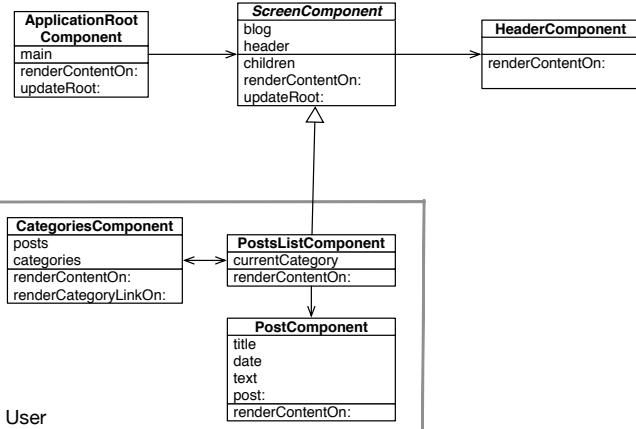

<span id="page-54-2"></span>**Figure 7-1** L'architecture des composants de la partie publique with categories.

#### **Displaying Categories**

We need a component to display a list of categories defined in the blog. This component should support the selection of one category. This component should be able to communicate with the component TBPostsListComponent to give it the currently selected category. Figure [7-1](#page-54-2) described the situation.

Remember that a category is simply expressed as a string in the model we defined in Chapter [2](#page-12-0) and how the following test illustrates it:

```
testAllBlogPostsFromCategory
  self assert: (blog allBlogPostsFromCategory: 'First Category')
    size equals: 1
```
#### **Component Definition**

Let us define a new component named TBCategoriesComponent. It keeps a sorted collection of string representing each category as well as a reference to the component managing the post list.

```
WAComponent subclass: #TBCategoriesComponent
   instanceVariableNames: 'categories postsList'
   classVariableNames: ''
   package: 'TinyBlog-Components'
```
We define the associated accessors.

```
TBCategoriesComponent >> categories
   ^ categories
TBCategoriesComponent >> categories: aCollection
   categories := aCollection asSortedCollection
TBCategoriesComponent >> postsList: aComponent
      postsList := aComponent
TBCategoriesComponent >> postsList
   ^ postsList
```
We define a creation method as a class method.

```
TBCategoriesComponent class >> categories: categories postsList:
    aTBScreen
   ^ self new categories: categories; postsList: aTBScreen
```
#### **From the Post List**

In the class TBPostsListComponent, we need to add an instance variable to store the current category.

```
TBScreenComponent subclass: #TBPostsListComponent
   instanceVariableNames: 'currentCategory'
   classVariableNames: ''
   package: 'TinyBlog-Components'
```
We define its associated accessors.

```
TBPostsListComponent >> currentCategory
   ^ currentCategory
TBPostsListComponent >> currentCategory: anObject
   currentCategory := anObject
```
#### **The method selectCategory:**

We define the method selectCategory: (protocol 'actions') to communicate the current category to the TBPostsListComponent component.

```
TBCategoriesComponent >> selectCategory: aCategory
   postsList currentCategory: aCategory
```
# 7.2 **Category Rendering**

We can now define method for the rendering of the category component on the page. Let us call it renderCategoryLinkOn:with:, we define in particular that clicking on a category will select it as the current one. We use a callback (message callback:). The argument of this message is a block that can contains any Pharo expression. This illustrates how simple is to call function to react to event.

```
TBCategoriesComponent >> renderCategoryLinkOn: html with: aCategory
   html tbsLinkifyListGroupItem
      callback: [ self selectCategory: aCategory ];
      with: aCategory
```
The method renderContentOn: of TBCategoriesComponent is simple: we iterate on all categories and we display them using Bootstrap.

```
TBCategoriesComponent >> renderContentOn: html
   html tbsListGroup: [
      html tbsListGroupItem
         with: [ html strong: 'Categories' ].
      categories do: [ :cat |
         self renderCategoryLinkOn: html with: cat ] ]
```
We are nearly there. We need to display the list of categories and update the posts based on the current category.

## 7.3 **Updating Post List**

<span id="page-57-0"></span>Now we should update the list of posts. We modify the rendering method of the component TBPostsListComponent.

The method readSelectedPosts collects the posts to be displayed. It filters them based on the current category. When the current category is nil, it means that the user did not select yet a category. Therefore we display all the posts. When the current category is something else than nil, the user selected a category and the application display the corresponding posts.

```
TBPostsListComponent >> readSelectedPosts
   ^ self currentCategory
      ifNil: [ self blog allVisibleBlogPosts ]
      ifNotNil: [ self blog allVisibleBlogPostsFromCategory: self
    currentCategory ]
```
We modify now the method responsible of the post list rendering:

```
TBPostsListComponent >> renderContentOn: html
   super renderContentOn: html.
   html render: (TBCategoriesComponent
               categories: (self blog allCategories)
               postsList: self).
   html tbsContainer: [
      self readSelectedPosts do: [ :p |
         html render: (TBPostComponent new post: p) ] ]
```
An instance of the component TBCategoriesComponent is added to the page and allows one to select the current category (see Figure [7-2\)](#page-58-0).

As previously explained, a new instance of TBCategoriesComponent is created each time the component TBPostsListComponent is rendered, therefore it is not mandatory to add it to the children sublist of the component.

#### **Possible Enhancements**

Hardcodeing class name and the creation logic of categories and posts is not really optimal. Propose some solution.

## <span id="page-57-1"></span>7.4 **Look and Layout**

We will not place better the component TBPostsListComponent using a more 'responsive' design (as shown in Figure [7-3\)](#page-59-1). It means that the CSS style should adapt the component to the available space.

Components are placed in a Bootstrap container then positioned on a line with two columns. Column dimension is determined based on the viewport and resolution of the device used. The 12 columsn of Bootstrap are distributed over the category and post lists.

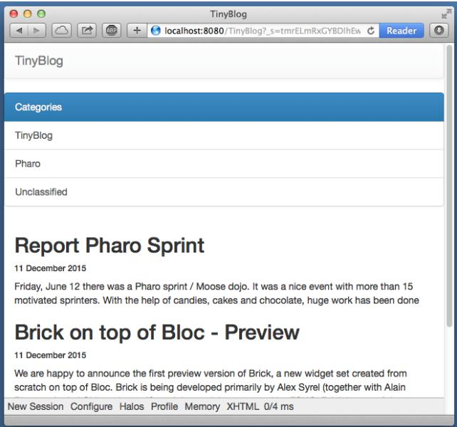

**Figure 7-2** Categories and Posts.

<span id="page-58-0"></span>In the case of a low resolution, the list of categories is placed above the post list (each element using 100% of the container width).

```
TBPostsListComponent >> renderContentOn: html
   super renderContentOn: html.
   html tbsContainer: [
      html tbsRow showGrid;
         with: [
            html tbsColumn
               extraSmallSize: 12;
               smallSize: 2;
               mediumSize: 4;
               with: [
                  html render: (TBCategoriesComponent
                    categories: (self blog allCategories)
                    postsList: self) ].
      html tbsColumn
               extraSmallSize: 12;
               smallSize: 10;
               mediumSize: 8;
               with: [
         self readSelectedPosts do: [ :p |
             html render: (TBPostComponent new post: p) ] ] ] ]
```
You should obtain a situation close to the one presented in Figure [7-3.](#page-59-1)

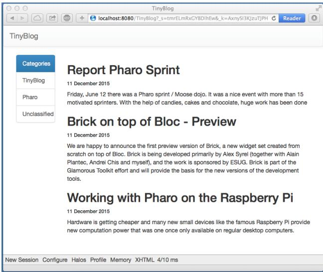

**Figure 7-3** Post list with a better layout.

<span id="page-59-1"></span>When one selects a category, the post list is updated. However, the selected category is not selected. We modify the following method to address this point.

```
TBCategoriesComponent >> renderCategoryLinkOn: html with: aCategory
   html tbsLinkifyListGroupItem
      class: 'active' if: aCategory = self postsList currentCategory;
      callback: [ self selectCategory: aCategory ];
      with: aCategory
```
Even if the code works, we cannot keep the method renderContentOn: in such state. It is far too long and not reusable. Propose a solution.

# <span id="page-59-0"></span>7.5 **Modular Code with Small Methods**

Here is our solution to the previous problem. To ease reading and future reuse, we start to define component creation methods.

```
TBPostsListComponent >> categoriesComponent
  ^ TBCategoriesComponent
      categories: self blog allCategories
      postsList: self
TBPostsListComponent >> postComponentFor: aPost
  ^ TBPostComponent new post: aPost
```

```
TBPostsListComponent >> renderContentOn: html
  super renderContentOn: html.
  html
    tbsContainer: [ html tbsRow
        showGrid;
        with: [
          html tbsColumn
            extraSmallSize: 12;
            smallSize: 2;
            mediumSize: 4;
            with: [ html render: self categoriesComponent ].
          html tbsColumn
            extraSmallSize: 12;
            smallSize: 10;
            mediumSize: 8;
            with: [ self readSelectedPosts
                do: [ :p | html render: (self postComponentFor: p) ]
    ] ] ]
```
#### **Another Pass**

We continue to cut this method in other smaller methods. We create one method for each of the elementary tasks.

```
TBPostsListComponent >> basicRenderCategoriesOn: html
  html render: self categoriesComponent
TBPostsListComponent >> basicRenderPostsOn: html
  self readSelectedPosts do: [ :p |
    html render: (self postComponentFor: p) ]
```
Then we use such tasks to simplify the method renderContentOn:.

```
TBPostsListComponent >> renderContentOn: html
   super renderContentOn: html.
   html
      tbsContainer: [
         html tbsRow
            showGrid;
            with: [ self renderCategoryColumnOn: html.
                  self renderPostColumnOn: html ] ]
TBPostsListComponent >> renderCategoryColumnOn: html
   html tbsColumn
      extraSmallSize: 12;
      smallSize: 2;
      mediumSize: 4;
      with: [ self basicRenderCategoriesOn: html ]
```

|          |              | ◀                                                                                                                                                                            <br>C<br>Reader                                                                                                                                                                                                      |  |  |
|----------|--------------|---------------------------------------------------------------------------------------------------------------------------------------------------------------------------------------------------------------------------------------------------------------------------------------------------------------------------------------------------------------------------------------------------|--|--|
| TinyBlog |              |                                                                                                                                                                                                                                                                                                                                                                                                   |  |  |
|          | Categories   | Report Pharo Sprint                                                                                                                                                                                                                                                                                                                                                                               |  |  |
|          | AJI          | 24 March 2016                                                                                                                                                                                                                                                                                                                                                                                     |  |  |
|          | Pharo        | Friday, June 12 there was a Pharo sprint / Moose dojo. It was a nice event with more than 15<br>motivated sprinters. With the help of candies, cakes and chocolate, huge work has been done                                                                                                                                                                                                       |  |  |
|          | TinyBlog     |                                                                                                                                                                                                                                                                                                                                                                                                   |  |  |
|          | Unclassified | Brick on top of Bloc - Preview<br>24 March 2016                                                                                                                                                                                                                                                                                                                                                   |  |  |
|          |              | We are happy to announce the first preview version of Brick, a new widget set created from<br>scratch on top of Bloc. Brick is being developed primarily by Alex Syrel (together with Alain<br>Plantec, Andrei Chis and myself), and the work is sponsored by ESUG. Brick is part of the<br>Glamorous Toolkit effort and will provide the basis for the new versions of the development<br>tools. |  |  |
|          |              | Working with Pharo on the Raspberry Pi                                                                                                                                                                                                                                                                                                                                                            |  |  |
|          |              | 24 March 2016                                                                                                                                                                                                                                                                                                                                                                                     |  |  |
|          |              | Hardware is getting cheaper and many new small devices like the famous Raspberry Pl provide<br>new computation power that was one once only available on regular desktop computers.                                                                                                                                                                                                               |  |  |

<span id="page-61-1"></span>**Figure 7-4** Final TinyBlog Public UI.

```
TBPostsListComponent >> renderPostColumnOn: html
   html tbsColumn
         extraSmallSize: 12;
         smallSize: 10;
         mediumSize: 8;
         with: [ self basicRenderPostsOn: html ]
```
<span id="page-61-0"></span>The final application is showing in Figure [7-4.](#page-61-1)

#### 7.6 **Conclusion**

We defined an interface for our blog using a set of components each specifying its own state and responsibility. Many web applications are built the same way reusing components. You have the foundation to build more advanced web application.

In the next chapter, we show how to manage authentification to access the post admin part of our application.

#### **Possible Enhancements**

As exercise you can:

- sort category alphabetically, or
- add a link named 'All' in the category list to display all the posts.

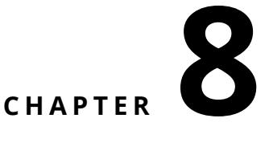

# <span id="page-62-0"></span>Authentication and Session

In this chapter we will develop a traditional scenario: the user should login to access to the administration part of the application. He does it using a login and password.

Figure [8-1](#page-62-1) shows the architecture that we will reach in this chapter.

Let us start to put in place a first version that allows one to navigate between the part of TinyBlog rendered by the component TBPostsListComponent and a first draft of the administration component as shown in Figure [8-2.](#page-64-0) This illustrates how to invoke a component.

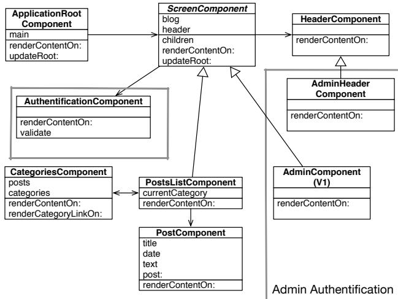

<span id="page-62-1"></span>**Figure 8-1** Authentication flow.

In the following we will build and integrate a component managing the login based on modal interaction. This will illustrate how we can elegantly map filed inputs to instance variables of a component.

Finally we will show how the user information is stored into the current session.

# <span id="page-63-0"></span>8.1 **A Simple Admin Component (v1)**

Let us define a really super simple administration component. This component inherits from the class TBScreenComponent as mentioned in previous chapters and illustrated in Figure [8-1.](#page-62-1)

```
TBScreenComponent subclass: #TBAdminComponent
   instanceVariableNames: ''
   classVariableNames: ''
   package: 'TinyBlog-Components'
```
We define a first version of the rendering method to be able to test our approach.

```
TBAdminComponent >> renderContentOn: html
   super renderContentOn: html.
   html tbsContainer: [
      html heading: 'Blog Admin'.
      html horizontalRule ]
```
# <span id="page-63-1"></span>8.2 **Adding 'admin' Button**

We add now a button in the header of the site (component TBHeaderComponent) so that the user can access to the admin as shown in Figure [8-2.](#page-64-0) To do so, we modify the existing components: TBHeaderComponent (header) et TBPostsListComponent (public part).

Let us add a button in the header:

```
TBHeaderComponent >> renderContentOn: html
    html tbsNavbar beDefault; with: [
       html tbsContainer: [
        self renderBrandOn: html.
        self renderButtonsOn: html
    ]]
TBHeaderComponent >> renderButtonsOn: html
   self renderSimpleAdminButtonOn: html
TBHeaderComponent >> renderSimpleAdminButtonOn: html
  html form: [
     html tbsNavbarButton
       tbsPullRight;
```

|                            | ■ (8) =<br>localh                                                                                                    |                                                         |
|----------------------------|----------------------------------------------------------------------------------------------------------------------|---------------------------------------------------------|
|                            | TinyBlog                                                                                                             | ●● < > ■<br>(AB) (1)<br>localhost                       |
| TinyBlog                   |                                                                                                                      | TinvBlog<br>TinyBlog                                    |
| Categories<br>Unclassified | Welcome in TinyBlog<br>6 Auqust 2018                                                                                 | Blog Admin                                              |
| TinyBlog                   | TinyBlog is a small blog engine made with Phar                                                                       |                                                         |
| Pharo                      | Report Pharo Sprint                                                                                                  |                                                         |
| admin                      | 6 August 2018<br>Friday, June 12 there was a Pharo sprint / Moos<br>motivated sprinters. With the help of candies, c |                                                         |
|                            | Brick on top of Bloc -<br>6 August 2018<br>Now Soccion Configures Holog Drofile Momon; VHTMI 0/0 me                  | New Session Configure Halos Profile Memory XHTML 2/3 ms |

<span id="page-64-0"></span>**Figure 8-2** Simple link to the admin part.

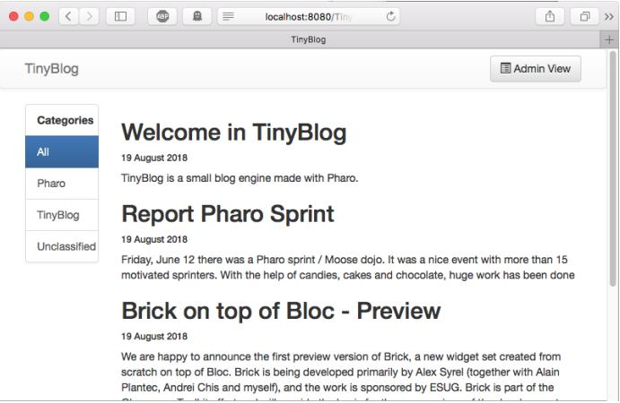

**Figure 8-3** Header with an admin button.

```
with: [
     html tbsGlyphIcon iconListAlt.
     html text: ' Admin View' ]]
```
When you refresh the web browser, the admin buttin is present but it does not have any effect (See Figure [8-3\)](#page-64-1).

We should define a callback on this button (message callback:) to replace the current component (TBPostsListComponent) by the administration component (TBAdminComponent).

#### 8.3 **Header Revision**

<span id="page-65-0"></span>Let us revise the definition of TBHeaderComponent by adding a new instance variable named component to store and access to the current component (either post list or admin component). This will allow us to access to the component from the header.

```
WAComponent subclass: #TBHeaderComponent
  instanceVariableNames: 'component'
  classVariableNames: ''
  package: 'TinyBlog-Components'
TBHeaderComponent >> component: anObject
   component := anObject
TBHeaderComponent >> component
   ^ component
```
We add a new class method.

```
TBHeaderComponent class >> from: aComponent
   ^ self new
    component: aComponent;
    yourself
```
#### <span id="page-65-1"></span>8.4 **Admin Button Activation**

We modify the component instantiation in TBScreenComponent method to pass the component which will be under the header.

```
TBScreenComponent >> createHeaderComponent
  ^ TBHeaderComponent from: self
```
Note that the method createHeaderComponent is defined in the superclass TBScreenComponent and it is applicable to all the subclasses.

We can add now the callback on the button:

```
TBHeaderComponent >> renderSimpleAdminButtonOn: html
  html form: [
  html tbsNavbarButton
    tbsPullRight;
    callback: [ component goToAdministrationView ];
    with: [
        html tbsGlyphIcon iconListAlt.
        html text: ' Admin View' ]]
```
We just need to define the method goToAdministrationView on the component TBPostsListComponent:

```
TBPostsListComponent >> goToAdministrationView
  self call: TBAdminComponent new
```
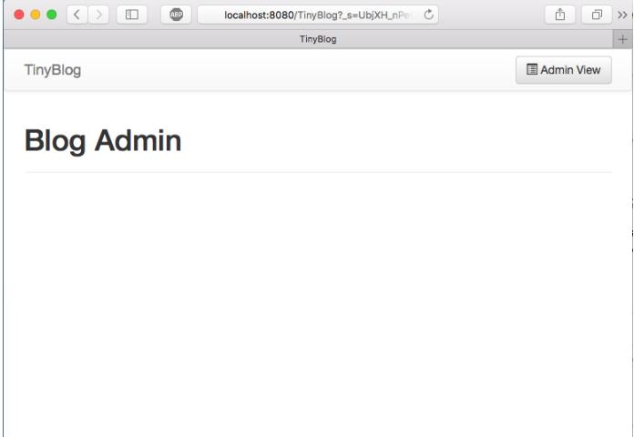

**Figure 8-4** Admin component under definition.

<span id="page-66-1"></span>Before clicking on the admin button, you should renew the current session by clicking on 'New Session': it will recreate the component TBHeaderComponent.

You should get the situation presented in Figure [8-4.](#page-66-1) The 'Admin' button allows one to access the admin part v1.

Pay attention not to click twice on the admin button because we do not manage it yet for the admin part. We will replace it by a Disconnect button.

# <span id="page-66-0"></span>8.5 **'disconnect' Button Addition**

When we display the admin part, we will replace the header component by a new one. This new header will display a disconnect button.

Let us define this new header component:

```
TBHeaderComponent subclass: #TBAdminHeaderComponent
  instanceVariableNames: ''
  classVariableNames: ''
  package: 'TinyBlog-Components'
TBAdminHeaderComponent >> renderButtonsOn: html
   html form: [ self renderDisconnectButtonOn: html ]
```
The TBAdminComponent component must use this header:

```
TBAdminComponent >> createHeaderComponent
   ^ TBAdminHeaderComponent from: self
```
Now we can specialize our new admin header to display a disconnect button.

```
TBAdminHeaderComponent >> renderDisconnectButtonOn: html
   html tbsNavbarButton
      tbsPullRight;
      callback: [ component goToPostListView ];
      with: [
         html text: 'Disconnect '.
         html tbsGlyphIcon iconLogout ]
TBAdminComponent >> goToPostListView
  self answer
```
What is see is that the message answer gives back the control to the component that calls it. So we go back the post list.

Reset the current session by clicking on 'New Session'. Then you can click on the 'Admin' button, you should see now the admin v1 display itself with a 'Disconnect' button. This button allows on to go back the public part as shown in Figure [8-2.](#page-64-0)

#### **call:/answer: Notion**

When you study the previous code, you see that we use the call:/answer: mechanism of Seaside to navigate between the components TBPostsList-Component and TBAdminComponent.

The message call: replaces the current component with the one passed in argument and gives it the flow of control. The message answer: returns a value to this call and gives back the flow of control to the calling argument. This mechanism is really poweful and elegant. It is explained in the vidéo 1 of week 5 of the Pharo Mooc ([http://rmod-pharo-mooc.lille.inria.fr/MOOC/](http://rmod-pharo-mooc.lille.inria.fr/MOOC/WebPortal/co/content_5.html) [WebPortal/co/content\\_5.html](http://rmod-pharo-mooc.lille.inria.fr/MOOC/WebPortal/co/content_5.html)).

# <span id="page-67-0"></span>8.6 **Modal Window for Authentication**

Let us develop now a authentication component that when invoked will open a dialog box to request the login and password. The result we want to obtain is shown in Figure [8-5.](#page-68-0)

There are are some libraries of components ready to be used. For example, the Heimdal project available at <http://www.github.com/DuneSt/> offers an authentication component or the Steam project <https://github.com/guillep/steam> offers ways to interrogate google ou twitter accounts.

#### **Authentication Component Definition**

We define a new subclass of WAComponent and its accessors. This component contains a login, a password and a component which invoked it to access to

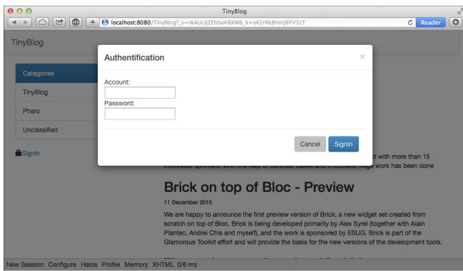

**Figure 8-5** Authentication component.

```
the admin part.
```

```
WAComponent subclass: #TBAuthentificationComponent
   instanceVariableNames: 'password account component'
   classVariableNames: ''
   package: 'TinyBlog-Components'
TBAuthentificationComponent >> account
   ^ account
TBAuthentificationComponent >> account: anObject
   account := anObject
TBAuthentificationComponent >> password
   ^ password
TBAuthentificationComponent >> password: anObject
   password := anObject
TBAuthentificationComponent >> component
   ^ component
TBAuthentificationComponent >> component: anObject
   component := anObject
```
The instance variable component will be initialized by the following class method: classe suivante :

```
TBAuthentificationComponent class >> from: aComponent
   ^ self new
      component: aComponent;
      yourself
```
# 8.7 **Authentication Component Rendering**

<span id="page-69-0"></span>The following method renderContentOn: defines the contents of a dialog box with the ID myAuthDialog. This ID will be used to select the component that should be made visible when in modal mode.

This dialog box has a header and a body. Note the use of the messages tbsModal, tbsModalBody:, and tbsModalContent: which supports a modal interaction with the component.

```
TBAuthentificationComponent >> renderContentOn: html
   html tbsModal
      id: 'myAuthDialog';
      with: [
         html tbsModalDialog: [
            html tbsModalContent: [
               self renderHeaderOn: html.
               self renderBodyOn: html ] ] ]
```
The header displays a button to close the dialog box and a title with large fonts. Note that you can also use the ESC key to close the modal window box.

```
TBAuthentificationComponent >> renderHeaderOn: html
   html
      tbsModalHeader: [
         html tbsModalCloseIcon.
         html tbsModalTitle
            level: 4;
            with: 'Authentication' ]
```
The body of the component displays the input field for the login identifier, password and some buttons.

```
TBAuthentificationComponent >> renderBodyOn: html
    html
        tbsModalBody: [
            html tbsForm: [
                self renderAccountFieldOn: html.
                self renderPasswordFieldOn: html.
                html tbsModalFooter: [ self renderButtonsOn: html ]
    ] ]
```
The method renderAccountFieldOn: shows how the value of an input field is passed and stored in an instance variable of a component when the user finishes its input.

The parameter of the callback: message is a bloc which takes as argument the value of the input field.

```
TBAuthentificationComponent >> renderAccountFieldOn: html
   html
      tbsFormGroup: [ html label with: 'Account'.
         html textInput
            tbsFormControl;
            attributeAt: 'autofocus' put: 'true';
            callback: [ :value | account := value ];
            value: account ]
```
The same process is used for the password.

```
TBAuthentificationComponent >> renderPasswordFieldOn: html
   html tbsFormGroup: [
      html label with: 'Password'.
      html passwordInput
         tbsFormControl;
         callback: [ :value | password := value ];
         value: password ]
```
Finally in the following renderContentOn: method, two buttons are added at the bottom of the modal window. The 'Cancel' button which allows one to close the window using the attribute 'data-dismiss' and the 'SignIn' button which sends the validate using a callback.

The enter key is bound to the 'SignIn' button activation when using the method tbsSubmitButton. This method sets the 'type' attribute to 'submit'.

```
TBAuthentificationComponent >> renderButtonsOn: html
   html tbsButton
      attributeAt: 'type' put: 'button';
      attributeAt: 'data-dismiss' put: 'modal';
      beDefault;
      value: 'Cancel'.
   html tbsSubmitButton
      bePrimary;
      callback: [ self validate ];
      value: 'SignIn'
```
In the validate method, we simply send a message to the main component giving it the information entered by the user.

```
TBAuthentificationComponent >> validate
  ^ component tryConnectionWithLogin: self account andPassword: self
    password
```
# <span id="page-70-0"></span>8.8 **Authentication Component Integration**

To integrate our authentication component, we modify the Admin button of the header component (TBHeaderComponent) as follows:

```
TBHeaderComponent >> renderButtonsOn: html
   self renderModalLoginButtonOn: html
TBHeaderComponent >> renderModalLoginButtonOn: html
   html render: (TBAuthentificationComponent from: component).
   html tbsNavbarButton
      tbsPullRight;
      attributeAt: 'data-target' put: '#myAuthDialog';
      attributeAt: 'data-toggle' put: 'modal';
      with: [
         html tbsGlyphIcon iconLock.
         html text: ' Login' ]
```
The method renderModalLoginButtonOn: starts by rendering the component TBAuthentificationComponent within this web page. This component is created during each display and it does not have to be returned by the children method. In addition, we add 'Login' button with a icon lock. When the user clicks on this button, the modal dialog identified with the ID myAuthDialog will be displayed.

Reloading the TinyBlog page, you should see now a 'Login' button in the header (button that will pop up the authentication we just developed) as illustrated by Figure [8-5.](#page-68-0)

# <span id="page-71-0"></span>8.9 **Naively Managing Logins**

When you click on the 'SignIn' button you get an error. Using the Pharo debugger, you can see that we should define the method tryConnectionWith-Login:andPassword: on the component TBPostsListComponent since it is the one sent by the callback of the button.

```
TBPostsListComponent >> tryConnectionWithLogin: login andPassword:
    password
   (login = 'admin' and: [ password = 'topsecret' ])
         ifTrue: [ self goToAdministrationView ]
         ifFalse: [ self loginErrorOccurred ]
```
<span id="page-71-1"></span>For the moment we store directly the login and password in the method and this is not really a good practice.

#### 8.10 **Managing Errors**

We defined the method goToAdministrationView. Let us add the method loginErrorOccured and a mechanism to display an error message when the user does not use the correct identifiers as shown in Figure [8-6.](#page-73-0)

For this we will add a new instance variable showLoginError that represents the fact that we should display an error.

```
TBScreenComponent subclass: #TBPostsListComponent
   instanceVariableNames: 'currentCategory showLoginError'
   classVariableNames: ''
   package: 'TinyBlog-Components'
```
The method loginErrorOccurred specifies that an error should be displayed.

```
TBPostsListComponent >> loginErrorOccurred
  showLoginError := true
```
We add a method to test this state.

```
TBPostsListComponent >> hasLoginError
   ^ showLoginError ifNil: [ false ]
```
We define also an error message.

```
TBPostsListComponent >> loginErrorMessage
   ^ 'Incorrect login and/or password'
```
We modify the method renderPostColumnOn: to perform a specific task to handle the errors.

```
TBPostsListComponent >> renderPostColumnOn: html
   html tbsColumn
      extraSmallSize: 12;
      smallSize: 10;
      mediumSize: 8;
      with: [
         self renderLoginErrorMessageIfAnyOn: html.
         self basicRenderPostsOn: html ]
```
The method renderLoginErrorMessageIfAnyOn: displays if necessary an error message. It sets the instance variable showLoginError so that we do not display the error undefinitely.

```
TBPostsListComponent >> renderLoginErrorMessageIfAnyOn: html
   self hasLoginError ifTrue: [
      showLoginError := false.
      html tbsAlert
         beDanger ;
         with: self loginErrorMessage
   ]
```
## <span id="page-72-0"></span>8.11 **Modeling the Admin**

We do not want to store the administrator identifiers in the code as we did previously. We revise this now and will store the identifiers in a model: a class Admin.

| 〈 〉 ■        | 3<br>(200<br>localhost                                                                                                                                                                                                                                                                   |  |  |
|--------------|------------------------------------------------------------------------------------------------------------------------------------------------------------------------------------------------------------------------------------------------------------------------------------------|--|--|
|              | Tim Blog                                                                                                                                                                                                                                                                                 |  |  |
| TinyBlog     | Login                                                                                                                                                                                                                                                                                    |  |  |
| Categories   | Inccorect login and/or password                                                                                                                                                                                                                                                          |  |  |
| AJI          |                                                                                                                                                                                                                                                                                          |  |  |
| Pharo        | Welcome in TinyBlog<br>10 August 2018                                                                                                                                                                                                                                                    |  |  |
| TinyBlog     | TinyBlog is a small blog engine made with Pharo.                                                                                                                                                                                                                                         |  |  |
| Unclassified | Report Pharo Sprint                                                                                                                                                                                                                                                                      |  |  |
|              | 10 August 2018                                                                                                                                                                                                                                                                           |  |  |
|              | Friday. June 12 there was a Pharo sprint / Moose doio. It was a nice event with more than 15<br>motivated sprinters. With the help of candies, cakes and chocolate, huge work has been done                                                                                              |  |  |
|              | Brick on top of Bloc - Preview                                                                                                                                                                                                                                                           |  |  |
|              | 10 August 2018                                                                                                                                                                                                                                                                           |  |  |
|              | We are happy to announce the first preview version of Brick, a new widget set created from<br>scratch on top of Bloc. Brick is being developed primarily by Alex Syrel (together with Alain<br>Plantec. Andrei Chis and myself), and the work is sponsored by ESUG. Brick is part of the |  |  |

<span id="page-73-0"></span>**Figure 8-6** Error message in case wrong identifiers.

Let us start to enrich our TinyBlog model with the notion of administrator. We define a class named TBAdministrator characterized by it pseudo, login and password.

```
Object subclass: #TBAdministrator
  instanceVariableNames: 'login password'
  classVariableNames: ''
  package: 'TinyBlog'
TBAdministrator >> login
   ^ login
TBAdministrator >> login: anObject
   login := anObject
TBAdministrator >> password
   ^ password
```
Note that we do not store the admin password in the instance variable password but its hash encoded in SHA256.

```
TBAdministrator >> password: anObject
   password := SHA256 hashMessage: anObject
```
We define also a new instance creation method.

```
TBAdministrator class >> login: login password: password
  ^ self new
      login: login;
      password: password;
      yourself
```
You can verify that the model works by executing the following expression:

luc := TBAdministrator login: 'luc' password: 'topsecret'.

## 8.12 **Blog admin**

<span id="page-74-0"></span>We decide for simplicity that a blog has one admin. We add the instance variable adminUser and an accessor in the classe TBBlog to store the blog admin.

```
Object subclass: #TBBlog
  instanceVariableNames: 'adminUser posts'
  classVariableNames: ''
  package: 'TinyBlog'
TBBlog >> administrator
   ^ adminUser
```
We define a default login and password that we use as default. As we will see later, we will modify such attributes and these modified attributes will be saved at the same time that the blog in a database.

```
TBBlog class >> defaultAdminPassword
   ^ 'topsecret'
TBBlog class >> defaultAdminLogin
   ^ 'admin'
```
Now we create a default admin.

```
TBBlog >> createAdministrator
  ^ TBAdministrator
      login: self class defaultAdminLogin
      password: self class defaultAdminPassword
```
And we initialize the blog to set a default administrateur.

```
TBBlog >> initialize
   super initialize.
   posts := OrderedCollection new.
   adminUser := self createAdministrator
```
## <span id="page-74-1"></span>8.13 **Setting a New Admin**

We should not recreate the blog:

```
TBBlog reset; createDemoPosts
```
We can now modify the admin information as follows:

```
|admin|
admin := TBBlog current administrator.
admin login: 'luke'.
admin password: 'thebrightside'.
TBBlog current save
```
Note that without doing anything, the blog admin information has been saved by Voyage in the database. Indeed the class TBBlog is a Voyage root, all its atttributes are automatically stored in the database when it received the message save.

#### **Possible Enhancements**

<span id="page-75-0"></span>Define some tests for the extensions by writing new unit tests.

# 8.14 **Integrating the Admin Information**

Let us modify the method tryConnectionWithLogin:andPassword: so that it uses the current blog admin identifiers. Note that we are comparing the hash SHA256 of the password since we do not store the password.

```
TBPostsListComponent >> tryConnectionWithLogin: login andPassword:
    password
   (login = self blog administrator login and: [
      (SHA256 hashMessage: password) = self blog administrator
    password ])
         ifTrue: [ self goToAdministrationView ]
         ifFalse: [ self loginErrorOccurred ]
```
# <span id="page-75-1"></span>8.15 **Storing the Admin in the Current Session**

With the current setup, when the blog admin wants to navigate between the private and public part, he must reconnects each time. We will simplify this situation but storing the current admin information in the session when the connection is succesful.

A session object is given to the each instance of the application. Such session allows on to keep information which are shared and accessible between components.

We will then store the current admin in a session and modify the components to display buttons that support a simplified navigation when the admin is logged.

When he explicitely disconnect or when the session expires, we delete the current session.

<span id="page-75-2"></span>Figure [8-7](#page-76-0) shows the navigation between the pages of TinyBlog.

## 8.16 **Definition and use of specific session**

Let us start to define a subclass of WASession and name it TBSession. We add in this new class an instance variable that stores the current admin.

| Partie publique (non connecté) | Fenêtre modale d'identification  |  |
|--------------------------------|----------------------------------|--|
|                                |                                  |  |
|                                |                                  |  |
|                                |                                  |  |
|                                |                                  |  |
|                                |                                  |  |
|                                |                                  |  |
|                                |                                  |  |
|                                |                                  |  |
|                                |                                  |  |
|                                |                                  |  |
|                                |                                  |  |
|                                |                                  |  |
|                                |                                  |  |
| Partie publique (connecté)     | Partie administration (connecté) |  |
|                                |                                  |  |
|                                |                                  |  |
|                                |                                  |  |
|                                |                                  |  |
|                                |                                  |  |
|                                |                                  |  |
|                                |                                  |  |
|                                |                                  |  |
|                                |                                  |  |
|                                |                                  |  |
|                                |                                  |  |

<span id="page-76-0"></span>**Figure 8-7** Navigation and identification in TinyBlog.

```
WASession subclass: #TBSession
    instanceVariableNames: 'currentAdmin'
    classVariableNames: ''
    package: 'TinyBlog-Components'
TBSession >> currentAdmin
    ^ currentAdmin
TBSession >> currentAdmin: anObject
    currentAdmin := anObject
```
We define a method isLogged allows one to know if the administration is logged.

```
TBSession >> isLogged
    ^ self currentAdmin notNil
```
Now we should indicate to Seaside to use TBSession as the class of the current session for our application. This initialization is done in the class method initialize in the class TBApplicationRootComponent as follows:

```
TBApplicationRootComponent class >> initialize
      "self initialize"
      | app |
      app := WAAdmin register: self asApplicationAt: 'TinyBlog'.
      app
         preferenceAt: #sessionClass put: TBSession.
      app
         addLibrary: JQDeploymentLibrary;
```

```
addLibrary: JQUiDeploymentLibrary;
addLibrary: TBSDeploymentLibrary
```
<span id="page-77-0"></span>Do not forget to exectute this expression TBApplicationRootComponent initialize before testing the application.

# 8.17 **Storing the Current Admin**

When a connection is successful, we add the admin object to the current session using the message currentAdmin:. Note that the current session is available to every Seaside component via self session.

```
TBPostsListComponent >> tryConnectionWithLogin: login andPassword:
    password
   (login = self blog administrator login and: [
      (SHA256 hashMessage: password) = self blog administrator
    password ])
         ifTrue: [
            self session currentAdmin: self blog administrator.
            self goToAdministrationView ]
         ifFalse: [ self loginErrorOccurred ]
```
# <span id="page-77-1"></span>8.18 **Simplified navigation**

To put in place the simplified navigation we discussed above, we modify the header to display either a login button or a a simple navigation button to the admin part without forcing any reconnection. For this we use the session and the fact that we can know if a user is logged.

```
TBHeaderComponent >> renderButtonsOn: html
    self session isLogged
        ifTrue: [ self renderSimpleAdminButtonOn: html ]
      ifFalse: [ self renderModalLoginButtonOn: html ]
```
You can test this new navigation but first create a new session ('New Session' button). One reconnected the admin is added in session. Note that the deconnection button does not work correctly since it does invalidate the session.

## <span id="page-77-2"></span>8.19 **Managing Deconnection**

We add a method reset on our session object to delete the current admin, invalidate the current session and redirect to the application entry point.

8.20 Simplified Navigation to the Public Part

```
TBSession >> reset
   currentAdmin := nil.
  self requestContext redirectTo: self application url.
  self unregister.
```
Now we modify the header deconnection button to send the message reset to the correct session.

```
TBAdminHeaderComponent >> renderDisconnectButtonOn: html
   html tbsNavbarButton
      tbsPullRight;
      callback: [ self session reset ];
      with: [
         html text: 'Disconnect '.
         html tbsGlyphIcon iconLogout ]
```
<span id="page-78-0"></span>Now we 'Disconnect' button works the way it should.

# 8.20 **Simplified Navigation to the Public Part**

We can add now a button in the header of the admin part to go back to the public part without being forced to get disconnected.

```
TBAdminHeaderComponent >> renderButtonsOn: html
  html form: [
    self renderDisconnectButtonOn: html.
    self renderPublicViewButtonOn: html ]
TBAdminHeaderComponent >> renderPublicViewButtonOn: html
   self session isLogged ifTrue: [
      html tbsNavbarButton
         tbsPullRight;
         callback: [ component goToPostListView ];
         with: [
            html tbsGlyphIcon iconEyeOpen.
            html text: ' Public View' ]]
```
<span id="page-78-1"></span>Now you can test the naviagtion. It should correspond to the situation depicted by Figure [8-7.](#page-76-0)

# 8.21 **Conclusion**

We put in place an authentication for TinyBlog. We create a reusable modal component. We made the distinction between component displayed when a user is connected or ot not and ease the navigation of a connected user using session.

We are now ready for the administration part of the application and we will work on this in the next chapter. We will take advantage of it to show and advanced aspect: the automatic form generation.

#### **Possible Enhancements**

You can:

- Add the admin logging in the header
- Manage multipel admin accounts.

# **C H A P T E R 9**

# <span id="page-80-0"></span>Administration Web Interface and Automatic Form Generation

We will now develop the administration part of TinyBlog. In previous chapter, we define Seaside components that interact together and where each component is responsible for its internal state, behavior and its graphical rendering.

In this chapter, we want to show that we can go a step further and generate Seaside components from object descriptions using the Magritte framework.

Figure [9-1](#page-81-0) shows a part of the result we will obtain, the other part being post edition.

Figure [9-2](#page-81-1) shows a survey of the architecture that we will develop in this chapter.

# <span id="page-80-1"></span>9.1 **Describing Domain Data**

Magritte is a library that allows one to generate various representations once the objects are described. Coupled with Seaside, Magritte generates forms and reports. The Quuve of the Debris Publishing company is a brillant example of Magritte power: all tables and reports are automatically generated (see <http://www.pharo.org/success>).

Data validation is also done at the Magritte level instead of being dispersed in the user interface code. This chapter will not cover such aspects. Resources on Magritte are a chapter in the Seaside book (<http://book.seaside.st>) as well as a tutorial under writing available at [https://github.com/SquareBracketAssocia](https://github.com/SquareBracketAssociates/Magritte)tes/ [Magritte](https://github.com/SquareBracketAssociates/Magritte).

| 000                                                     |              | TinyBlog<br>◀ ▷ △ ○ ○ ○ ○ ○ ○ ○ ○ ○ ○ ○ ○ ○ ○ ○ ○ ○ ○ ○ ○ ○ ○ ○ ○ ○ ○ ○ ○ ○ ○ ○ ○ ○ ○ ○ ○ ○ ○ ○ ○ ○ ○ ○ ○ ○ ○ ○ ○ ○ ○ ○ ○ ○ ○ ○ ○ ○ ○ ○ ○ ○ ○ ○ ○ ○ ○ ○ ○ ○ ○ ○ ○ ○ ○ ○ ○ ○ ○ ○ ○ ○ ○ ○ ○ | 134<br>C Reader<br>10 |
|---------------------------------------------------------|--------------|-------------------------------------------------------------------------------------------------------------------------------------------------------------------------------------------|-----------------------|
|                                                         |              | 20 = 1 epibud arxiv FogBugz casa trip baremes twitter MSaca Gdocs ESUC: 2015 mlarchives weekly                                                                                            | »<br>+                |
| TinyBlog                                                |              |                                                                                                                                                                                           |                       |
|                                                         |              |                                                                                                                                                                                           |                       |
|                                                         |              |                                                                                                                                                                                           |                       |
| Blog Admin                                              |              |                                                                                                                                                                                           |                       |
| Add post                                                |              |                                                                                                                                                                                           |                       |
| Title                                                   | Category     | Date                                                                                                                                                                                      |                       |
| Youpi                                                   | Unclassified | 23 December 2015                                                                                                                                                                          | View Edit Delete      |
| Tiny Blog Tutorial                                      | Tiny Blog    | 13 December 2015                                                                                                                                                                          | View Edit Delete      |
| Cours à Lome                                            | Cours        | 13 December 2015                                                                                                                                                                          | View Edit Delete      |
|                                                         |              |                                                                                                                                                                                           |                       |
|                                                         |              |                                                                                                                                                                                           |                       |
|                                                         |              |                                                                                                                                                                                           |                       |
|                                                         |              |                                                                                                                                                                                           |                       |
|                                                         |              |                                                                                                                                                                                           |                       |
|                                                         |              |                                                                                                                                                                                           |                       |
|                                                         |              |                                                                                                                                                                                           |                       |
|                                                         |              |                                                                                                                                                                                           |                       |
|                                                         |              |                                                                                                                                                                                           |                       |
| New Session Configure Halos Profile Memory XHTML 2/3 ms |              |                                                                                                                                                                                           |                       |

<span id="page-81-0"></span>**Figure 9-1** Post managment.

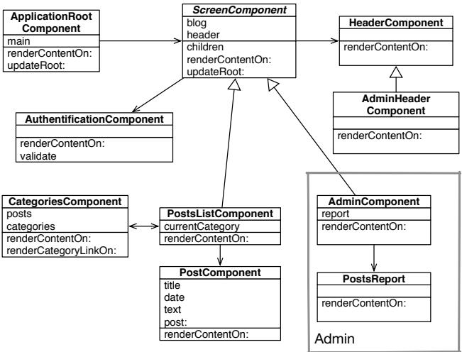

<span id="page-81-1"></span>**Figure 9-2** Administration components.

A description is an object that specifies information on the datat of our model as well as its type, whether the information is mandatory, if it should be sorted and what is the default value.

## <span id="page-82-0"></span>9.2 **Post Description**

Let us start to describe the five instance variable of TBPost with Magritte. Then we will show how we can get a form generated for us.

We will define the five following methods in the protocol 'magritte-descriptions' of the class TBPost. Note that the method names are not important but we follow a convention. This is the pragma <magritteDescription> (method annotation) that allows Magritte to identify descriptions.

The post title is a string of characters that is mandatory.

```
TBPost >> descriptionTitle
   <magritteDescription>
   ^ MAStringDescription new
      accessor: #title;
      beRequired;
      yourself
```
A post test is a multi-line that is mandatory.

```
TBPost >> descriptionText
   <magritteDescription>
   ^ MAMemoDescription new
      accessor: #text;
      beRequired;
      yourself
```
The category is represented as a string and it does not have to be given. In such case the post will be sorted in the 'Unclassified' category.

```
TBPost >> descriptionCategory
   <magritteDescription>
   ^ MAStringDescription new
      accessor: #category;
      yourself
```
The post creation time is important since it is used to sort posts. It is then required.

```
TBPost >> descriptionDate
   <magritteDescription>
   ^ MADateDescription new
      accessor: #date;
      beRequired;
      yourself
```
The visible instance variable should be a Boolean and it is required.

```
TBPost >> descriptionVisible
   <magritteDescription>
   ^ MABooleanDescription new
      accessor: #visible;
      beRequired;
      yourself
```
We could enrich the descriptions so that it is not possible to publish a post with a date before the current day. We could change the description of a category to make sure that a category is part of a predefined list of categories. We do not do it to keep it to the main point.

# <span id="page-83-0"></span>9.3 **Automatic Component Creation**

Once a post described we can generate a Seaside component by sending a message asComponent to an post instance.

aTBPost asComponent

<span id="page-83-1"></span>Let us see how we can use this in the following.

# 9.4 **Building a post report**

We will develop a new component that will be used by the component TBAdminComponent. The TBPostReport component is a report that will contain all the posts. As we will see below the report Seaside component will be generated automatically from Magritte. We could have develop only one component but we prefer to distinguish it from the admin component for future evolution.

#### **The PostsReport Component**

Post list is displayed using a report dynamically generated by Magritte. We will use Magritte to implement the different behaviors of the admin activity (post list, post creation, edition, delete of a post).

The component TBPostsReport is a subclass of TBSMagritteReport that manages reports with Bootstrap.

```
TBSMagritteReport subclass: #TBPostsReport
   instanceVariableNames: ''
   classVariableNames: ''
   package: 'TinyBlog-Components'
```
We add a creation method that takes a blog as argument.

```
TBPostsReport class >> from: aBlog
   | allBlogs |
   allBlogs := aBlog allBlogPosts.
   ^ self rows: allBlogs description: allBlogs anyOne
    magritteDescription
```
# <span id="page-84-0"></span>9.5 **AdminComponent Integration with PostsReport**

Let us now revise our TBAdminComponent to display this report.

We add an instance variable report and its accessors in the class TBAdmin-Component.

```
TBScreenComponent subclass: #TBAdminComponent
  instanceVariableNames: 'report'
  classVariableNames: ''
  package: 'TinyBlog-Components'
TBAdminComponent >> report
   ^ report
TBAdminComponent >> report: aReport
   report := aReport
```
Since the report is a son component of the admin component we should not forget to redefine the method children. Note that the collection contains the subcomponents defined in the superclass (header component) and those in current class (report component).

```
TBAdminComponent >> children
   ^ super children copyWith: self report
```
In initialize method we instantiate a report by giving it a blog instance.

```
TBAdminComponent >> initialize
   super initialize.
   self report: (TBPostsReport from: self blog)
```
Let us modify the admin part rendering to display the report.

```
TBAdminComponent >> renderContentOn: html
   super renderContentOn: html.
   html tbsContainer: [
      html heading: 'Blog Admin'.
      html horizontalRule.
      html render: self report ]
```
You can test this change by refreshing your web browser.

| ABP   1  <br><<br>> =                                   | C<br>localhost | rib          |  |  |  |  |  |  |
|---------------------------------------------------------|----------------|--------------|--|--|--|--|--|--|
| +<br>TinyBlog                                           |                |              |  |  |  |  |  |  |
| TinyBlog                                                | S Public View  | Disconnect + |  |  |  |  |  |  |
| Blog Admin                                              |                |              |  |  |  |  |  |  |
| Welcome in TinyBlog                                     | 13 August 2018 | TinyBlog     |  |  |  |  |  |  |
| Report Pharo Sprint                                     | 13 August 2018 | Pharo        |  |  |  |  |  |  |
| Brick on top of Bloc - Preview                          | 13 August 2018 | Pharo        |  |  |  |  |  |  |
| The sad story of unclassified blog posts                | 13 August 2018 | Unclassified |  |  |  |  |  |  |
| Working with Pharo on the Raspberry Pi                  | 13 August 2018 | Pharo        |  |  |  |  |  |  |
|                                                         |                |              |  |  |  |  |  |  |
| New Session Configure Halos Profile Memory XHTML 3/4 ms |                |              |  |  |  |  |  |  |

<span id="page-85-1"></span>**Figure 9-3** Magritte report with posts.

## 9.6 **Filter Columns**

<span id="page-85-0"></span>By default, a report displays the full data of each post. However, some columns are not useful We should filter the columns. Here we only keep the title, category and publication date.

We add a class method for the column selection and modifier the method from: to use this.

```
TBPostsReport class >> filteredDescriptionsFrom: aBlogPost
  "Filter only some descriptions for the report columns."
  ^ aBlogPost magritteDescription
    select: [ :each | #(title category date) includes: each accessor
    selector ]
TBPostsReport class >> from: aBlog
   | allBlogs |
   allBlogs := aBlog allBlogPosts.
   ^ self rows: allBlogs description: (self
    filteredDescriptionsFrom: allBlogs anyOne)
```
Figure [9-3](#page-85-1) shows the situation that you should get.

# 9.7 **Report Enhancements**

<span id="page-86-0"></span>The previous report is pretty raw. There is no title on columns and the display column order is not fixed. This can change from one instance to the other. To handle this, we modify the description for each instance variable. We specify a priority and a title (message label:) as follows:

```
TBPost >> descriptionTitle
   <magritteDescription>
   ^ MAStringDescription new
      label: 'Title';
      priority: 100;
      accessor: #title;
      beRequired;
      yourself
TBPost >> descriptionText
   <magritteDescription>
   ^ MAMemoDescription new
      label: 'Text';
      priority: 200;
      accessor: #text;
      beRequired;
      yourself
TBPost >> descriptionCategory
   <magritteDescription>
   ^ MAStringDescription new
      label: 'Category';
      priority: 300;
      accessor: #category;
      yourself
TBPost >> descriptionDate
   <magritteDescription>
   ^ MADateDescription new
      label: 'Date';
      priority: 400;
      accessor: #date;
      beRequired;
      yourself
TBPost >> descriptionVisible
   <magritteDescription>
   ^ MABooleanDescription new
      label: 'Visible';
      priority: 500;
      accessor: #visible;
      beRequired;
      yourself
```
You should obtain the situation such as represented by Figure [9-4.](#page-87-1)

| 0 | 00 < > ■<br>(BBP) (1)                                   | localhost    | C              |               |  |  |
|---|---------------------------------------------------------|--------------|----------------|---------------|--|--|
|   | TinyBlog                                                |              |                |               |  |  |
|   | TinyBlog                                                |              | @ Public View  | Disconnect C+ |  |  |
|   | Blog Admin                                              |              |                |               |  |  |
|   | Title                                                   | Category     | Date           |               |  |  |
|   | Welcome in TinyBlog                                     | TinyBlog     | 13 August 2018 |               |  |  |
|   | Report Pharo Sprint                                     | Pharo        | 13 August 2018 |               |  |  |
|   | Brick on top of Bloc - Preview                          | Pharo        | 13 August 2018 |               |  |  |
|   | The sad story of unclassified blog posts                | Unclassified | 13 August 2018 |               |  |  |
|   | Working with Pharo on the Raspberry Pi                  | Pharo        | 13 August 2018 |               |  |  |
|   |                                                         |              |                |               |  |  |
|   | New Session Configure Halos Profile Memory XHTML 2/0 ms |              |                |               |  |  |

<span id="page-87-1"></span>**Figure 9-4** Administration Report.

## 9.8 **Post Administration**

<span id="page-87-0"></span>We can now put in place a CRUD (Create Read Update Delete) allowing to generate posts. For this, we will add a new column (instance of MACommand-Column) to the report. This column will group the different operations using the addCommandOn: message. This method allows one to define a link that will execute a method of the current object. We give access to the blog the report is build for.

```
TBSMagritteReport subclass: #TBPostsReport
    instanceVariableNames: 'blog'
    classVariableNames: ''
    package: 'TinyBlog-Components'
TBSMagritteReport >> blog
   ^ blog
TBSMagritteReport >> blog: aTBBlog
   blog := aTBBlog
```
The method from: adds a new column to the report. It groups the different operations.

```
TBPostsReport class >> from: aBlog
    | report blogPosts |
    blogPosts := aBlog allBlogPosts.
    report := self rows: blogPosts description: (self
    filteredDescriptionsFrom: blogPosts anyOne).
    report blog: aBlog.
    report addColumn: (MACommandColumn new
```

```
addCommandOn: report selector: #viewPost: text: 'View';
yourself;
   addCommandOn: report selector: #editPost: text: 'Edit';
yourself;
   addCommandOn: report selector: #deletePost: text: 'Delete';
yourself).
^ report
```
We will have to define the methods linked to each operation in the following section.

In addition this method is a bit lengthly and it does not separate the report definition from the operation definition. A possible solution is to create an instance method named addCommands and to call it explicitly. Try to do it to practice.

# <span id="page-88-0"></span>9.9 **Post Addition**

Addition a post is not associated with a post and we place just before the main report. Since this behavior is then part of the component TBPostsReport, we should redefine the method renderContentOn: of the component TBPostsReport to insert a link add.

```
TBPostsReport >> renderContentOn: html
   html tbsGlyphIcon iconPencil.
   html anchor
      callback: [ self addPost ];
      with: 'Add post'.
   super renderContentOn: html
```
<span id="page-88-1"></span>Login another time and you should get the situation as it is represented in Figure [9-5.](#page-89-0)

# 9.10 **CRUD Action Implementation**

Each action (Create/Read/Update/Delete) should invoke methods of the instance of TBPostsReport. We implement them now. A personalized form is built based on the requested operation (it is not necessary to have a save butten when the user is just viewing a post).

# <span id="page-88-2"></span>9.11 **Post Addition**

Let us begin with post addition. The following method renderAddPostForm: iillustres the power of Magritte to generate forms:

| Blog Admin         |              |                  |                  |
|--------------------|--------------|------------------|------------------|
| Add post           |              |                  |                  |
| Title              | Category     | Date             |                  |
| Youpi              | Unclassified | 23 December 2015 | View Edit Delete |
| Tiny Blog Tutorial | Tiny Blog    | 13 December 2015 | View Edit Delete |
| Cours à Lome       | Cours        | 13 December 2015 | View Edit Delete |
|                    |              |                  |                  |

<span id="page-89-0"></span>**Figure 9-5** Post report with links.

```
TBPostsReport >> renderAddPostForm: aPost
    ^ aPost asComponent
        addDecoration: (TBSMagritteFormDecoration buttons: { #save
    -> 'Add post' . #cancel -> 'Cancel'});
        yourself
```
Here the message asComponent, sent to the object of class TBPost, creates directly a component. We add a decoration to this component to manage ok/cancel.

The method addPost displays the component returned by the method renderAddPostForm: and when a new post is created, it is added for the blog. The method writeBlogPost: saves the changes the user may do.

```
TBPostsReport >> addPost
    | post |
    post := self call: (self renderAddPostForm: TBPost new).
    post ifNotNil: [ blog writeBlogPost: post ]
```
In this method we see another use of the message call: to give the control to a component. The link to add a post allows one to display a creation form that we will make better looking later (See Figure [9-6\)](#page-90-0).

| Title:<br>Soon new TB version<br>Text:<br>Category: Unclassified<br>Date:<br>20 August 2018<br>Choose<br>O Visible<br>Visible: | Blog Admin |  |  |  |
|--------------------------------------------------------------------------------------------------------------------------------|------------|--|--|--|
|                                                                                                                                |            |  |  |  |
|                                                                                                                                |            |  |  |  |
|                                                                                                                                |            |  |  |  |
|                                                                                                                                |            |  |  |  |
|                                                                                                                                |            |  |  |  |

<span id="page-90-0"></span>**Figure 9-6** Basic rendering of a post.

#### **Post Display**

To display a post in read-only mode, we define two methods similar to the previous. Note that we use the readonly: true to indicate that the form is not editable.

```
TBPostsReport >> renderViewPostForm: aPost
   ^ aPost asComponent
       addDecoration: (TBSMagritteFormDecoration buttons: { #cancel
    -> 'Back' });
       readonly: true;
       yourself
```
Looking at a post does not require any extra action other than rendering it.

```
TBPostsReport >> viewPost: aPost
   self call: (self renderViewPostForm: aPost)
```
#### **Post Edition**

To edit a post, we use the same approach.

```
TBPostsReport >> renderEditPostForm: aPost
   ^ aPost asComponent addDecoration: (
      TBSMagritteFormDecoration buttons: {
         #save -> 'Save post'.
         #cancel -> 'Cancel'});
      yourself
```
Now the method editPost: gets the value of the call: message and saves the changes made.

```
TBPostsReport >> editPost: aPost
   | post |
   post := self call: (self renderEditPostForm: aPost).
   post ifNotNil: [ blog save ]
```
#### **Removing a post**

We must now adding the method removeBlogPost: to the class TBBlog:

```
TBBlog >> removeBlogPost: aPost
    posts remove: aPost ifAbsent: [ ].
    self save.
```
Let us add a unit test:

```
TBBlogTest >> testRemoveBlogPost
    self assert: blog size equals: 1.
    blog removeBlogPost: blog allBlogPosts anyOne.
    self assert: blog size equals: 0
```
To avoid an unwanted operation, we use a modal dialog so that the user confirms the deletion of the post. One the post is displayed, the list of managed posts by TBPostsReport is changed and should be refresh.

```
TBPostsReport >> deletePost: aPost
    (self confirm: 'Do you want remove this post ?')
        ifTrue: [ blog removeBlogPost: aPost ]
```
#### <span id="page-91-0"></span>9.12 **Refreshing Posts**

The methods addPost: and deletePost: are working well but the display is not refreshed. We need to refresh the post lists using the expression self refresh.

```
TBPostsReport >> refreshReport
    self rows: blog allBlogPosts.
    self refresh.
TBPostsReport >> addPost
  | post |
  post := self call: (self renderAddPostForm: TBPost new).
  post
    ifNotNil: [ blog writeBlogPost: post.
      self refreshReport ]
TBPostsReport >> deletePost: aPost
    (self confirm: 'Do you want remove this post ?')
        ifTrue: [ blog removeBlogPost: aPost.
                 self refreshReport ]
```
<span id="page-92-0"></span>The report is not working and it even manage input constraints: for example, mandatory fields should be filled up.

# 9.13 **Better Form Look**

To take advantage of Bootstrap, we will modify Magritte definitions. First we specify that the report rendering based on Bootstrap.

A container in Magritte is the element that will contain the other components created from descriptions.

```
TBPost >> descriptionContainer
    <magritteContainer>
    ^ super descriptionContainer
        componentRenderer: TBSMagritteFormRenderer;
        yourself
```
We want can now pay attention of the different input fields and improve their appearance.

```
TBPost >> descriptionTitle
    <magritteDescription>
    ^ MAStringDescription new
        label: 'Title';
        priority: 100;
        accessor: #title;
        requiredErrorMessage: 'A blog post must have a title.';
        comment: 'Please enter a title';
        componentClass: TBSMagritteTextInputComponent;
        beRequired;
        yourself
TBPost >> descriptionText
    <magritteDescription>
    ^ MAMemoDescription new
        label: 'Text';
        priority: 200;
        accessor: #text;
        beRequired;
        requiredErrorMessage: 'A blog post must contain a text.';
        comment: 'Please enter a text';
        componentClass: TBSMagritteTextAreaComponent;
        yourself
TBPost >> descriptionCategory
    <magritteDescription>
    ^ MAStringDescription new
        label: 'Category';
        priority: 300;
        accessor: #category;
        comment: 'Unclassified if empty';
```
#### Administration Web Interface and Automatic Form Generation

| 000                   | TinyBlog                                                                                                                                                                      |              | M |
|-----------------------|-------------------------------------------------------------------------------------------------------------------------------------------------------------------------------|--------------|---|
|                       | ◀│▷│﹝﹝○│〈〈〈〈〈〈〈〈〈〈〈〈〈〈〈〉 〈〈〉〉〉〉〈〉〉〉〉〉〉〉〉〉〉〉〉〉〉〉〉〉〉〉〉〉〉〉〉〉 〉 〉 〉 〉 〉 〉 〉 〉 〉 〉 〉 〉 〉 〉 〉 〉 〉 〉 〉 〉 〉 ㆍ 〉 ㆍ ㆍ ㆍ ㆍ ㆍ ㆍ ㆍ ㆍ ㆍ ㆍ ㆍ ㆍ ㆍ ㆍ ㆍ ㆍ ㆍ ㆍ ㆍ ㆍ ㆍ ㆍ ㆍ ㆍ ㆍ ㆍ ㆍ ㆍ ㆍ ㆍ ㆍ ㆍ ㆍ ㆍ ㆍ | C Reader   O |   |
| TinyBlog              |                                                                                                                                                                               |              |   |
|                       |                                                                                                                                                                               |              |   |
|                       |                                                                                                                                                                               |              |   |
| Blog Admin            |                                                                                                                                                                               |              |   |
| Title                 |                                                                                                                                                                               |              |   |
| Welcome in TinyBlog   |                                                                                                                                                                               |              |   |
| Please enter a title  |                                                                                                                                                                               |              |   |
| Text                  |                                                                                                                                                                               |              |   |
|                       | TinyBlog is a small blog engine made with Pharo.                                                                                                                              |              |   |
|                       |                                                                                                                                                                               |              |   |
| Please enter a text   |                                                                                                                                                                               |              |   |
| Category              |                                                                                                                                                                               |              |   |
| TinyBlog              |                                                                                                                                                                               |              |   |
| Unclassified if empty |                                                                                                                                                                               |              |   |
| Date                  |                                                                                                                                                                               |              |   |
| 25 March 2016         | Choose                                                                                                                                                                        |              |   |
| V Visible             |                                                                                                                                                                               |              |   |
| Save post             | Cancel                                                                                                                                                                        |              |   |
|                       |                                                                                                                                                                               |              |   |
|                       |                                                                                                                                                                               |              |   |

<span id="page-93-1"></span>**Figure 9-7** Post form addition with Bootstrap.

```
componentClass: TBSMagritteTextInputComponent;
        yourself
TBPost >> descriptionVisible
    <magritteDescription>
    ^ MABooleanDescription new
        checkboxLabel: 'Visible';
        priority: 500;
        accessor: #visible;
        componentClass: TBSMagritteCheckboxComponent;
        beRequired;
        yourself
```
<span id="page-93-0"></span>Based on new Magritte descriptions, forms generated now use Bootstrap. For example, the post form edition should not looks like Figure [9-7.](#page-93-1)

#### 9.14 **Conclusion**

In this chapter we defined the administration of TinyBlog based on report built out of the posts contained in the current blog. We added links to manage CRUD for each post. What we show is that adding descriptions on post let us generate Seaside components automatically.

# **C H A P T E R 10**

# <span id="page-94-0"></span>Loading Chapter Code

This chapter contains the expressions to load the code described in each of the chapters. Such expressions can be executed in any Pharo 8.0 (or above) image. Nevertheless, using the Pharo MOOC image (cf. Pharo Launcher) is usually faster because it already includes several libraries such as: Seaside, Voyage, ...

When you start for example the chapter 4, you can load all the code of the previous chapters (1, 2, and 3) by following the process described in the following section 'Chapter 4'.

Obviously, we believe that this is better that you use you own code but having our code at hand can help you in case you would be stuck.

# <span id="page-94-1"></span>10.1 **Chapter 3: Extending and Testing the Model**

You can load the correction of the previous chapter as follow:

```
Metacello new
   baseline:'TinyBlog';
   repository: 'github://LucFabresse/TinyBlog:chapter2/src';
   onConflict: [ :ex | ex useLoaded ];
   load
```
Run the tests! To do so, you can use the TestRunner (Tools menu > Test Runner), look for the package TinyBlog-Tests and click on "Run Selected". All tests should be green.

### 10.2 **Chapter 4: Data Persitency using Voyage and Mongo**

<span id="page-95-0"></span>You can load the correction of the previous chapter as follow:

```
Metacello new
   baseline:'TinyBlog';
   repository: 'github://LucFabresse/TinyBlog:chapter3/src';
   onConflict: [ :ex | ex useLoaded ];
   load
```
<span id="page-95-1"></span>Once loaded execute the tests.

## 10.3 **Chapter 5: First Steps with Seaside**

You can load the correction of the previous chapter as follow:

```
Metacello new
   baseline:'TinyBlog';
   repository: 'github://LucFabresse/TinyBlog:chapter4/src';
   onConflict: [ :ex | ex useLoaded ];
   load
```
Execute the tests.

To test the application, start the HTTP server:

ZnZincServerAdaptor startOn: 8080.

Open your web browser at http://localhost:8080/TinyBlog

You may need to recreate some posts as follows:

<span id="page-95-2"></span>TBBlog reset ; createDemoPosts

## 10.4 **Chapitre 6: Web Components for TinyBlog**

You can load the correction of the previous chapter as follow:

```
Metacello new
   baseline:'TinyBlog';
   repository: 'github://LucFabresse/TinyBlog:chapter5/src';
   onConflict: [ :ex | ex useLoaded ];
   load
```
<span id="page-95-3"></span>Same process as above.

## 10.5 **Chapitre 7: Managing Categories**

You can load the correction of the previous chapter as follow:

10.6 Chapitre 8: Authentication and Session

```
Metacello new
   baseline:'TinyBlog';
   repository: 'github://LucFabresse/TinyBlog:chapter6/src';
   onConflict: [ :ex | ex useLoaded ];
   load
```
To test the application, start the HTTP server:

```
ZnZincServerAdaptor startOn: 8080.
```
Open your web browser at http://localhost:8080/TinyBlog

You may need to recreate some posts as follows:

<span id="page-96-0"></span>TBBlog reset ; createDemoPosts

# 10.6 **Chapitre 8: Authentication and Session**

You can load the correction of the previous chapter as follow:

```
Metacello new
   baseline:'TinyBlog';
   repository: 'github://LucFabresse/TinyBlog:chapter7/src';
   onConflict: [ :ex | ex useLoaded ];
   load
```
To test the application, start the HTTP server:

```
ZnZincServerAdaptor startOn: 8080.
```
# 10.7 **Chapitre 9: Administration Web Interface and Automatic Form Generation**

You can load the correction of the previous chapter as follow:

```
Metacello new
   baseline:'TinyBlog';
   repository: 'github://LucFabresse/TinyBlog:chapter8/src';
   onConflict: [ :ex | ex useLoaded ];
   load
```
# <span id="page-96-2"></span>10.8 **Latest Version of TinyBlog**

The most up-to-date version of TinyBlog can be loaded as follow:

```
Metacello new
   baseline:'TinyBlog';
   repository: 'github://LucFabresse/TinyBlog/src';
   onConflict: [ :ex | ex useLoaded ];
```
load.

# <span id="page-98-0"></span>**C H A P T E R 11**

# Save your code

When you save the Pharo image (Pharo Menu > Save menuentry), it contains all objects of the system as well as all classes. This solution is useful but fragile. We will show you how Pharoers save their code directly using Iceberg. Iceberg is the Pharo code versionning tools (introduced in Pharo 7.0) that directly send code to well-known Web sites such as: github, bitbucket, or gitlab.

We suggest you read the chapter in the book "Managing Your Code with Iceberg" (available at <http://books.pharo.org>).

We list the key points here:

- Create an account on <http://www.github.com> or similar.
- Create a project on <http://www.github.com> or similar.
- Add a new project into Iceberg by choosing the option: clone from github.
- Create a folder 'src' with the filelist or using the command line in the folder that you just cloned.
- Open your project and add your packages (Define a baseline to be able to reload your code – check [https://github.com/pharo-open-documentation](https://github.com/pharo-open-documentation/pharo-wiki/blob/master/General/Baselines.md)/ [pharo-wiki/blob/master/General/Baselines.md](https://github.com/pharo-open-documentation/pharo-wiki/blob/master/General/Baselines.md))
- Commit your code.
- Push your code on github.